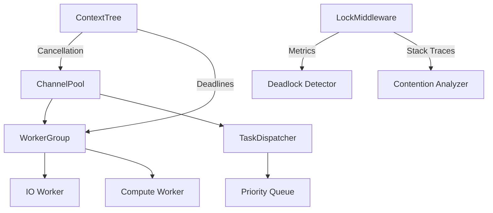

# Concurrency Core Subdomain

## 1. Purpose
Provides foundational concurrency primitives and patterns migrated from C++ OSL components while adapting to Go's memory model and goroutine paradigm.

Kubernetes and Containerization design detials should be left to other domains when possible and handled through contracts and interfaces. Only absolutely required k8s and containerization aspects should be included in the concurrency domain, only if there are no other options

## 2. Core Components

### Migrated Components
| C++ Component       | Go Equivalent               | Notes |
|---------------------|-----------------------------|-------|
| OSL::Mutex          | locking.ContextMutex        | Integrated with Systems policies and context awareness |
| OSL::Atomic         | atomic.Int/atomic.Bool      | Native usage with QoS enforcement |
| OSL::Thread         | goroutines + waitgroups     | Simplified lifecycle + context propagation |
| MutexLocker         | defer-based locking         | Compile-time safety + stack tracking |
| OSL::Runnable       | func() + context.Context    | Cancellable operations |
| ThreadImplementation| runtime.LockOSThread        | Pinned goroutines for C interop |

### New Components


## 3. Interface Contracts

### Core Interfaces
```go
type LockManager interface {
    NewMutex() *sync.Mutex
    NewRWMutex() *sync.RWMutex
    WithContext(ctx context.Context) context.Context
}

type AtomicInt32 interface {
    Add(int32) int32
    CompareAndSwap(old, new int32) bool
    Load() int32
    Store(int32)
}
```

### Cross-Domain Contracts
```go
// Network domain concurrency requirements
type PacketPipeline interface {
    BufferedChannel() chan<- Packet
    SetConcurrency(workers int, bufferSize int)
    ProcessingMetrics() PipelineStats
}

// AI domain scheduling contracts  
type TaskScheduler interface {
    Schedule(task Runnable, priority int) error
    Cancel(taskID string) bool
    Throttle(priorityClass int, rps int) 
}

// Systems domain monitoring
type ConcurrencyMonitor interface {
    TrackMutex(name string, mutex sync.Locker)
    GoroutineCount() int
    ChannelPressure(ch any) float64 // 0-1 utilization
    
    // Systems domain integration
    GetResourceLimits() ResourceQuota       // Abstract resource limits
    ReportDeadlock(d Deadlock)              // Generic deadlock reporting
    GetTopologyHints() TopologyHints        // Abstract topology awareness
}

type ContainerResources struct {
    CPUShares     int           // From container limits
    MemoryMB      int           // Total available memory
    MaxGoroutines int           // Calculated from CPU shares
}

type TopologyHints struct {
    NUMAPolicy    NUMARules     // NUMA allocation rules
    ResourceQuota ResourceLimit // Compute/memory constraints
}

// Contract compliance note:
// - All methods must be safe to call concurrently
// - Systems domain provides container abstractions
// - No direct Kubernetes API dependencies allowed
```

## 4. Supplemental Files Reference

### Key Reference Documents
1. **SUPPLEMENT-atomic.md**
   - Atomic operation migration details
   - Memory model alignment between C++ and Go
   - Verification protocols and performance critical paths
   - Kubernetes QoS compliance requirements

2. **SUPPLEMENT-lockhierarchy.md**  
   - Visual lock acquisition order diagrams
   - Lock ordering rules and policies
   - Container QoS class enforcement
   - Kubernetes operator integration
   - Systems domain topology coordination
   - CRD definitions for cluster-wide policies

3. **SUPPLEMENT-threadpools.md**
   - Worker pool architectures
   - Work stealing algorithms
   - QoS-driven scaling policies
   - NUMA-aware work distribution
   - Kubernetes CRD specifications
   - Systems policy integration

4. **SUPPLEMENT-numa.md**
   - NUMA-aware locking/work distribution
   - Node affinity and cross-node policies
   - Work stealing algorithms
   - Kubernetes NUMA CRD definitions
   - Systems domain integration specs

5. **SUPPLEMENT-errorhandling.md**
   - Panic recovery and context propagation
   - Deadlock resolution strategies
   - NUMA-aware error types
   - Systems alert integration
   - Context cancellation workflows

3. **INTERFACES.md**
   - Core concurrency interface contracts
   - Cross-domain integration points
   - Task pool configuration details
   - Metrics collection specifications
   - QoS class definitions from Systems domain

## 5. Migration Notes

1. **Atomic Migration**:
   - Replaced platform-specific assembly with runtime/internal/atomic
   - Added metrics for atomic operation counts
   - Converted manual barriers to sync/atomic memory ordering

2. **Containerization Changes**:
   - Removed all Win32 critical section code
   - Eliminated UI thread synchronization 
   - Replaced platform-specific implementations with Go runtime
   - Added container-aware resource limits
   
3. **Systems Domain Integration**:
   ```mermaid
   graph LR
       A[Concurrency] -->|Policy Requests| B[Systems Domain]
       B -->|Provides| C[Resource Limits]
       B -->|Provides| D[NUMA Policy]
       B -->|Provides| E[QoS Class]
       style B stroke:#ffaa00
   ```
   - Worker pools scale using Systems-provided resource limits
   - Lock placement follows Systems-defined NUMA policies
   - Deadlock handling uses Systems resolution strategies
   - Metrics pipeline feeds into Systems monitoring

4. **Dropped Components**:
   | Component          | Reason                  | Replacement            |
   |--------------------|-------------------------|------------------------|
   | Win32 CRITICAL_SEC | Container incompatible | sync.Mutex             |
   | UI Event Threads   | Headless operation      | Channel-based events   |
   | Manual Refcounting | GC integration          | runtime.SetFinalizer   |

### Behavior Changes
| C++ Pattern          | Go Pattern                 | Risk |
|----------------------|----------------------------|------|
| Manual refcount       | GC + finalizers            | Potential early collection |
| pthreads              | goroutines                 | Different scheduling |
| lock/unlock methods   | defer mutex.Unlock()       | Channel-based communication preferred       |

### Performance Critical Paths
1. Packet processing mutex hierarchy
2. AI decision tree RW locks
3. Network writer goroutine channel
