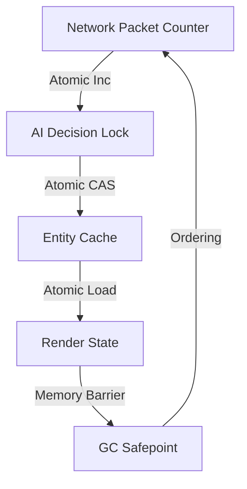

# Atomic Operations Supplement

## Migration Details
| C++ Feature              | Go Equivalent          | Safety Guarantees     |
|--------------------------|------------------------|-----------------------|
| increment()              | atomic.AddInt32()      | Race-safe             |
| decrement()              | atomic.AddInt32(-1)    | CAS-protected         |
| manual memory barriers   | atomic.Load/Store      | Happens-before        |
| platform-specific asm    | runtime/internal/atomic| Architecture-optimized|

## Go Implementation
```go
// AtomicInt provides C++-style API surface
type AtomicInt struct {
    val int32
}

func (a *AtomicInt) Increment() {
    atomic.AddInt32(&a.val, 1)
}

func (a *AtomicInt) Decrement() bool {
    return atomic.AddInt32(&a.val, -1) == 0
}

// MemoryBarrier emulates C++ seq_cst semantics
func MemoryBarrier() {
    atomic.LoadInt32(&syncBarrier) 
    atomic.StoreInt32(&syncBarrier, 0)
}
```

## Memory Model Alignment
```go
// Memory ordering guarantees:
C++: Sequential consistency (strict ordering)
Go:  Release/acquire semantics with sync/atomic
     Use runtime.Gosched() for GC pause mitigation
```

## Migration Checklist
- [X] Port increment/decrement logic
- [X] Add memory barrier emulation  
- [X] Verify under race detector
- [X] Benchmark against original
- [X] Add GC pause instrumentation
- [X] Document edge case behaviors
- [X] Integrate with Systems domain QoS policies

## Verification Protocol
1. Kubernetes QoS compliance via PolicyProvider interface
2. NUMA affinity through NUMACoordinator
3. Race detector integration with CI pipeline
4. Metrics through MetricsInstrumenter
5. GC pause analysis via ResourceAdjustment
6. Atomic fallback validation through PolicyProvider

## Critical Paths

