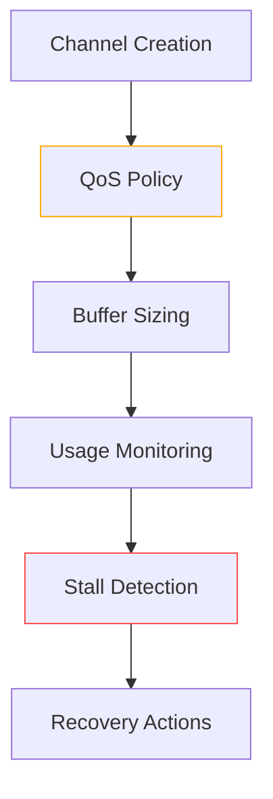

# Channel Safety Supplement

## Validation Rules


## Core Requirements
1. **Buffer Limits**:
   - Guaranteed QoS: Buffer ≤ container_cpu * 100
   - Burstable: Buffer ≤ container_cpu * 50  
   - BestEffort: Buffer ≤ 10

2. **Stall Detection**:
   - Producer: >95% buffer full for 1s
   - Consumer: 0% buffer full for 5s
   - Deadlock: No activity for 30s

3. **Recovery**:
   ```go
   type RecoveryAction interface {
       ResetChannel(ch chan interface{})
       ExpandBuffer(ch chan interface{}, delta int) error
       DrainChannel(ch chan interface{}, fn func(interface{}))
       NotifyStall(StallEvent)
   }
   ```

## Systems Integration
```yaml
apiVersion: concurrency.gokore.io/v1alpha1
kind: ChannelPolicy
metadata:
  name: ai-command-channel
spec:
  qosClass: Guaranteed
  bufferRules:
    baseSize: 100
    scalingFactor: cpu
  stallThresholds:
    producer: 950ms
    consumer: 5s
    deadlock: 30s
  numaAffinity:
    required: false
    preferredNodes: [0]
```

## Validation Checklist
- [ ] Buffer size policy enforcement
- [ ] Stall threshold configuration
- [ ] NUMA-aware channel allocation
- [ ] Systems policy integration
- [ ] Recovery action implementations
