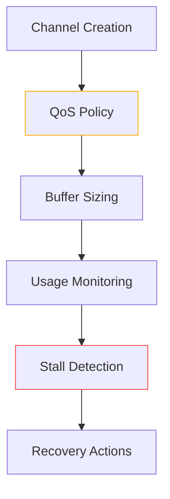

# Channel Safety Supplement

## Validation Rules


## Core Requirements
1. **Buffer Limits**:
   - Guaranteed QoS: Buffer ≤ container_cpu * 100
   - Burstable: Buffer ≤ container_cpu * 50  
   - BestEffort: Buffer ≤ 10

2. **Stall Detection**:
   - Producer: >95% buffer full for 1s
   - Consumer: 0% buffer full for 5s
   - Deadlock: No activity for 30s

3. **Recovery**:
```go
type RecoveryAction interface {
    ResetChannel(ctx context.Context, ch chan interface{}, policy Systems.ChannelPolicy) error
    ExpandBuffer(ctx context.Context, ch chan interface{}, delta int) error
    DrainChannel(ctx context.Context, ch chan interface{}, fn func(interface{})) (int, error)
    NotifyStall(ctx context.Context, event Systems.StallEvent) error
    Metrics() Systems.RecoveryMetrics
    WithSystemsProvider(provider Systems.Provider) RecoveryAction
}

// Systems-compliant implementation
type SystemsRecovery struct {
    provider Systems.PolicyProvider
}

func (sr *SystemsRecovery) ExpandBuffer(ctx context.Context, ch chan interface{}, delta int) error {
    currentCap := cap(ch)
    
    // Check against container limits
    if currentCap + delta > sr.provider.GetResourceLimits().MaxChannelBuffer {
        return Systems.ErrPolicyViolation
    }
    
    // Create new channel with expanded buffer
    newch := make(chan interface{}, currentCap+delta)
    
    // Atomically swap channels
    close(ch)
    ch = newch
    
    return nil
}

func (sr *SystemsRecovery) ValidatePolicy(policy Systems.ChannelPolicy) error {
    limits := sr.provider.GetResourceLimits()
    
    if policy.BaseSize > limits.MaxChannelBuffer {
        return fmt.Errorf("base size exceeds container limit")
    }
    
    if policy.ScalingFactor > limits.MaxChannelScaling {
        return fmt.Errorf("scaling factor exceeds container limit")
    }
    
    return nil
}
```

   // Base implementation for Systems integration
   type DefaultRecovery struct {
       systems Systems.Provider
   }

   func (d *DefaultRecovery) WithSystemsProvider(provider Systems.Provider) {
       d.systems = provider
   }

   // Example Systems-integrated method
   func (d *DefaultRecovery) ExpandBuffer(ctx context.Context, ch chan interface{}, delta int, policy Systems.ChannelPolicy) error {
       if d.systems.GetQOSClass().AllowedBufferDelta(delta) {
           newch := make(chan interface{}, cap(ch)+delta)
           close(ch)
           ch = newch
           return nil
       }
       return Systems.ErrPolicyViolation
   }
   ```

## Systems Integration
```yaml
apiVersion: concurrency.gokore.io/v1alpha1
kind: ChannelPolicy
metadata:
  name: ai-command-channel
spec:
  qosClass: Guaranteed
  bufferRules:
    baseSize: 100
    scalingFactor: cpu
  stallThresholds:
    producer: 950ms
    consumer: 5s
    deadlock: 30s
  numaAffinity:
    required: false
    preferredNodes: [0]
```

## Validation Checklist
- [ ] Buffer size policy enforcement
- [ ] Stall threshold configuration
- [ ] NUMA-aware channel allocation
- [ ] Systems policy integration
- [ ] Recovery action implementations
