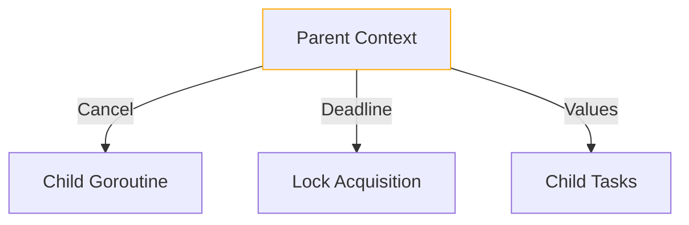

# Concurrency Error Handling Supplement

## 1. Panic Recovery Protocol
```go
type PanicHandler interface {
    Recover(ctx context.Context, recoverFn func() interface{}) error
    WrapGoroutine(fn Runnable) Runnable
    ReportPanic(p PanicRecord)
}

type PanicRecord struct {
    Stack      string
    Timestamp  time.Time
    GoroutineID int
    Context    map[string]string
}
```

## 2. Context Propagation Rules


## 3. Deadlock Resolution Strategies
| Strategy | Use Case | Systems Integration |
|----------|----------|---------------------|
| Timeout Escalation | Local deadlocks | Kubernetes eviction hooks |
| Resource Stealing | Cross-NUMA deadlocks | Cluster coordinator |
| Priority Inversion | QoS class conflicts | Systems policy engine |
| Full Rollback | Atomic operation failures | Transaction manager |

## 4. NUMA-Aware Error Handling
```go
type NUMAError struct {
    SourceNode    int
    RequestedNode int 
    Distance      int
    ResourceType  string
}

func (e NUMAError) Error() string {
    return fmt.Sprintf("NUMA error: cannot access %s from node %d (distance %d)",
        e.ResourceType, e.RequestedNode, e.Distance)
}

type NUMAErrorHandler interface {
    Handle(err error) (retry bool, node int)
    RegisterFallback(handler func(NUMAError) bool)
    Metrics() NUMAErrorMetrics
}
```

## Migration Checklist
- [X] Context propagation in core primitives
- [X] Panic recovery middleware
- [X] Deadlock resolution strategies
- [X] NUMA error types
- [ ] Integration with Systems domain alerts
