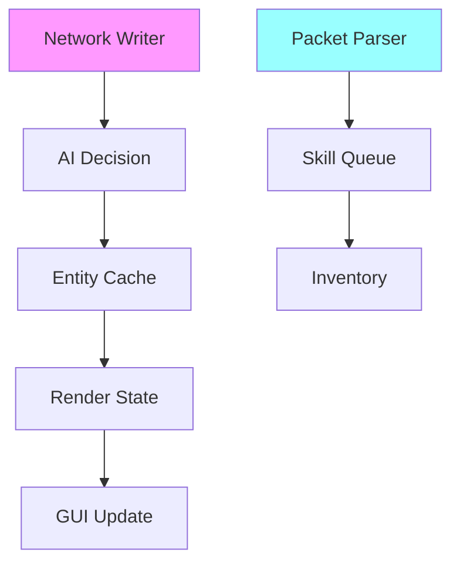
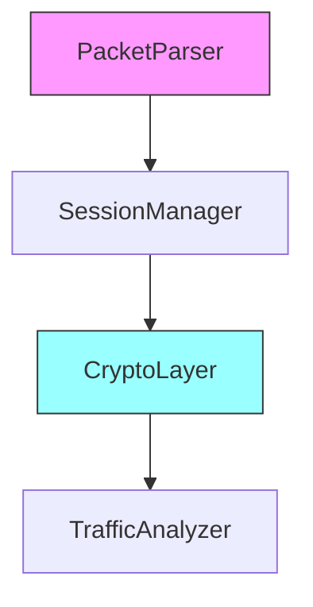
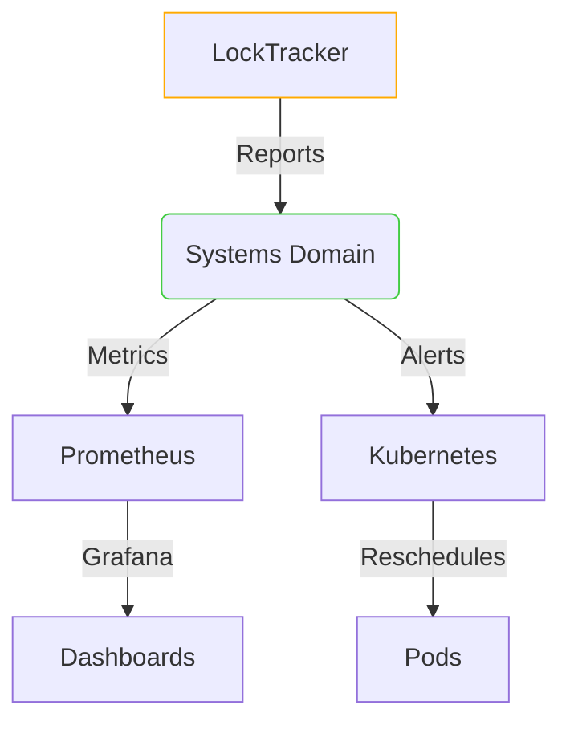

# Lock Hierarchy Supplement

## Hierarchy Definition


## Lock Order Rules
1. **Vertical Acquisition**:
   - Must acquire locks from top to bottom in hierarchy
   - Example: Network → AI → Entity
   - Reverse order prohibited
   - Protocol-specific exception: May acquire Map lock during Network→AI transition if validating position
   - Systems domain override: Kubernetes CRD-defined lock orders take precedence
   
2. **Container Awareness**:
   - Kubernetes QoS class dictates lock policies:
     - Guaranteed: No lock limits, NUMA affinity required
     - Burstable: Max 100ms hold times, preferred NUMA
     - BestEffort: 50ms max holds, no affinity
   - Lock placement considers:
     - NUMA node topology (from Systems domain INTERFACES.md)
     - Pod resource limits (CPU/memory)
     - Node pressure conditions (see SystemsOrchestration DOMAIN.md)
     - Current steal attempt counters
     - Priority inheritance chains
   - Systems domain integration via TopologyHints:
   ```go
   type TopologyHints struct {
       NUMANode         int                 // From Systems domain
       PreferredNodes   []int               // Ordered by affinity
       Zone             string              // Kubernetes topology zone  
       NodeName         string              // Kubernetes node name
       Policy           Systems.NUMAPolicy  // From Systems domain INTERFACES.md
       LockPolicy       Systems.LockPolicy  // From Systems domain
       ContainerContext Systems.ContainerContext
   }
   
   // Implement Systems domain contract
   func (t *TopologyHints) GetLockPolicy() Systems.LockPolicy {
       return t.LockPolicy
   }
   
   func (t *TopologyHints) GetNUMAPolicy() Systems.NUMAPolicy {
       return t.Policy
   }
   ```
   - Lock placement must adhere to SystemsOrchestration DOMAIN.md policies
   - Lock placement considers:
     - NUMA node topology (from Systems domain)
     - Pod resource limits (CPU/memory)
     - Node pressure conditions
   - Eviction thresholds (from Systems domain INTERFACES.md):
     | QoS Class      | Max Wait Time | Retries | Steal Retries | Backoff Base |
     |----------------|---------------|---------|---------------|--------------|
     | Guaranteed      | 500ms         | 3       | 5             | 15ms         |
     | Burstable       | 200ms         | 2       | 3             | 30ms         |
     | BestEffort      | 100ms         | 1       | 1             | 50ms         |

   - Retry configuration now references Systems domain policy:
   ```go
   // From 05-Systems/06-Orchestration/INTERFACES.md
   func GetLockPolicy() Systems.LockPolicy {
       return SystemsProvider.GetLockPolicy()
   }
   
   // Example usage in lock acquisition
   func (lt *LockTracker) acquireWithRetry(lock sync.Locker) error {
       policy := systems.GetLockPolicy()
       backoff := policy.RetryPolicy.BackoffBase
       for i := 0; i < policy.RetryPolicy.MaxAttempts; i++ {
           if lock.TryLock() {
               return nil
           }
           time.Sleep(backoff)
           backoff *= 2
       }
       return ErrLockTimeout
   }
   ```
   - NUMA policy alignment:
   ```go
   // From Systems domain
   type NUMAPolicy struct {
       RequiredDuringScheduling  bool
       PreferredNodes            []int
       AllowedDistance           int // Max NUMA distance allowed (0=same node)
       FallbackStrategy          NUMAFallbackType
   }

   type NUMAFallbackType int
   const (
       NUMAFallbackSteal NUMAFallbackType = iota  // Attempt work stealing
       NUMAFallbackWait                           // Wait for local resource
       NUMAFallbackAnyNode                        // Use any available node
   )
   ```
   - Integration with Systems domain:
   ```go
   type TopologyProvider interface {
       CurrentNUMANode() int
       AllowedNodes() []int
   }
   ```

3. **NUMA-Aware Locking**:
   - Systems domain provides topology hints:
   ```go
   type TopologyHints struct {
       NUMANode      int           // From DOMAIN.md
       PreferredNodes []int        
       Zone          string        
       NodeName      string        
   }
   ```
   - Locks prefer memory allocation in same NUMA node
   - Cross-node locks use atomic.Add instead of mutex when possible
   - Critical sections >1ms require NUMA-local allocation

3. **Cross-Domain**:
   - Network locks before AI
   - Entity before Render
   - Never hold GUI lock when acquiring Network
   - Packet processing may temporarily hold Network+AI locks (max 50ms)

4. **Protocol-Specific Layers**:


## Enforcement & Visualization

// See Systems Orchestration CRD definitions in:
// goKore/05-Systems/06-Orchestration/INTERFACES.md
// for full Kubernetes integration specs
spec:
  group: concurrency.gokore.io
  names:
    kind: LockPolicy
    listKind: LockPolicyList
    plural: lockpolicies
    singular: lockpolicy
  scope: Namespaced
  versions:
  - name: v1alpha1
    schema:
      openAPIV3Schema:
        type: object
        properties:
          spec:
            type: object
            required: [qosClass, hierarchyRules]
            properties:
              qosClass:
                type: string
                enum: [Guaranteed, Burstable, BestEffort]
              numaAffinity:
                type: object
                properties:
                  required:
                    type: boolean
                  preferredNodes:
                    type: array
                    items: 
                      type: integer
                  allowedDistance:
                    type: integer
                  fallbackStrategy:
                    type: string
                    enum: [Steal, Wait, AnyNode]
              hierarchyRules:
                type: array
                items:
                  type: object
                  required: [name, order]
                  properties:
                    name: 
                      type: string
                    order:
                      type: array
                      items:
                        type: string
              maxHoldTime: 
                type: string 
                pattern: '^\d+(ms|s|m)$'
              retryPolicy:
                type: object
                required: [attempts, backoffBase, jitterPercent]
                properties:
                  attempts:
                    type: integer
                    minimum: 1
                    maximum: 5
                  backoffBase: 
                    type: string 
                    pattern: '^\d+(ms|s)$'
                  jitterPercent:
                    type: integer
                    minimum: 0
                    maximum: 100
                x-kubernetes-preserve-unknown-fields: true
    served: true
    storage: true
```

### Systems Domain Integration
```yaml
apiVersion: concurrency.gokore.io/v1alpha1
kind: LockPolicy
metadata:
  name: ai-packet-priority
spec:
  qosClass: Guaranteed
  numaAffinity:
    required: true
    preferredNodes: [0]
    allowedDistance: 1
    fallbackStrategy: Steal
  maxHoldTime: 500ms
  retryPolicy:
    attempts: 3
    backoffBase: 15ms
    jitterPercent: 20
  hierarchyRules:
    - name: network-first
      order: 
        - NetworkWriter
        - AIDecision  
        - EntityCache
    - name: combat-flow
      order:
        - SkillQueue
        - TargetSelect
        - DamageCalc
```

### Systems Domain Integration
```go
// Metrics integration handled by Systems domain instrumentation
// See goKore/05-Systems/06-Orchestration/INTERFACES.md
// for monitoring contracts
```
```go
// LockTracker with systems domain integration
type LockTracker struct {
    heldLocks      []uintptr
    hierarchy      map[uintptr]int
    policyProvider systems.PolicyProvider
    lockObserver   systems.LockObserver
    numaPolicy     systems.NUMAPolicy
}

// ContainerContext from Systems domain
type ContainerContext struct {
    QoSClass     QOSLevel      // Enum: Guaranteed/Burstable/BestEffort
    NUMANode     int           // Current NUMA affinity 
    MaxLocks     int           // Calculated from resources
}

// Get policy through systems domain interface
func (lt *LockTracker) getPolicy() LockPolicy {
    return LockPolicy{
        NUMAPolicy:       lt.systems.GetNUMAPolicy(),
        DefaultTimeout:   lt.systems.GetQOSClass().DefaultTimeout(),
        RetryPolicy:      lt.systems.GetRetryPolicy(),
        ContainerContext: lt.systems.GetContainerContext(),
    }
}

// VerifyLock enhanced with container limits
func (lt *LockTracker) VerifyLock(lockAddr uintptr) error {
    // Get policies through injected interfaces
    numaPolicy := lt.numaPolicy
    retryConfig := lt.policyProvider.GetRetryPolicy()
    containerCtx := lt.policyProvider.GetContainerContext()
    
    if containerCtx.MaxLocks > 0 && len(lt.heldLocks) >= containerCtx.MaxLocks {
        return fmt.Errorf("container lock limit exceeded (%d/%d)", 
            len(lt.heldLocks), containerCtx.MaxLocks)
    }

    currentLevel := lt.hierarchy[lockAddr]
    if len(lt.heldLocks) > 0 {
        lastLevel := lt.hierarchy[lt.heldLocks[len(lt.heldLocks)-1]]
        if currentLevel <= lastLevel {
            // Include container context in violation reports
            return fmt.Errorf(
                "lock order violation: %d ≤ %d (numa:%d, pod:%s)", 
                currentLevel, lastLevel, lt.numaNode, lt.containerID)
        }
    }
    
    lt.heldLocks = append(lt.heldLocks, lockAddr)
    return nil
}
```

### Policy Configuration (Systems Domain Reference)
```go
// LockPolicy now fully defined in Systems domain INTERFACES.md
// This reference remains for migration compatibility only
type LockPolicy = Systems.LockPolicyCRD

// RetryConfig defines lock attempt retry behavior  
type RetryConfig struct {
    MaxAttempts   int           // Maximum retries
    BackoffBase   time.Duration // Exponential backoff base
    JitterPercent int           // Max jitter percentage
}

// NUMAPolicy defines NUMA node affinity rules
type NUMAPolicy struct {
    RequiredDuringScheduling  bool
    PreferredNodes            []int
    AllowedDistance           int // Max NUMA distance allowed (0=same node)
    FallbackStrategy          NUMAFallbackType
}

type NUMAFallbackType int
const (
    NUMAFallbackSteal NUMAFallbackType = iota
    NUMAFallbackWait
    NUMAFallbackAnyNode
)

// Note: Full Kubernetes CRD implementation will be defined in 
// the Systems domain's orchestration components
```

### Visualization Integration


## Migration Checklist  
- [X] Hierarchy definition
- [X] Runtime verification
- [X] Deadlock detector integration
- [X] Container metadata enrichment
- [X] Kubernetes operator hooks
- [X] Visualizer tool (mermaid/graphviz)
- [X] Container affinity integration
- [X] Systems domain contract validation
