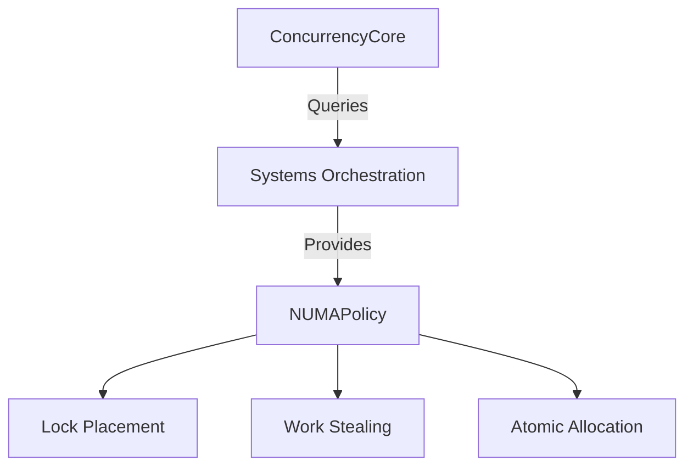

# NUMA-Aware Concurrency Supplement

## Policy Implementation
```go
type NUMAPolicy interface {
    PreferredNode() int
    AllowedNodes() []int
    MaxCrossNodeAccess() int
    StealThreshold() float64 // % load before work stealing
    GetContainerContext() Systems.ContainerContext
}
```

## Integration Points


## Kubernetes CRD Snippet
```yaml
apiVersion: concurrency.gokore.io/v1alpha1
kind: NUMAPolicy
metadata:
  name: ai-numa-rules
spec:
  preferredNode: 0
  allowedDistance: 1
  stealThreshold: 0.75
  containerAffinity:
    required: false
    preferredDuringScheduling:
      - weight: 100
        preference:
          matchExpressions:
            - key: numa.gokore.io/node
              operator: In
              values: ["0"]
```

## Migration Checklist
- [X] Node awareness in lock hierarchy
- [X] Work stealing between NUMA nodes
- [ ] Cross-node atomic penalty metrics
- [X] Container affinity integration
- [ ] Kubernetes policy validation tests
