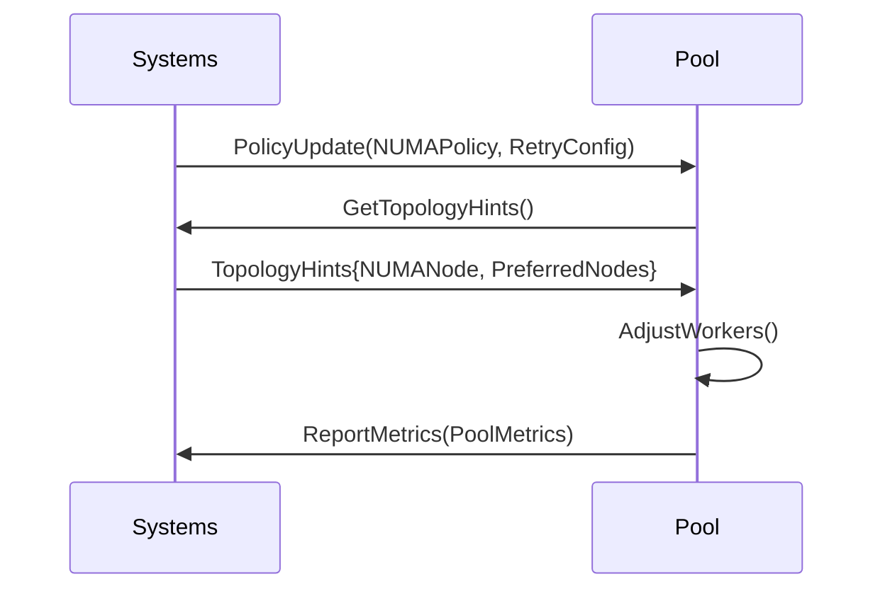

# Threadpool Migration Supplement

## C++ to Go Patterns
| C++ Pattern | Go Equivalent | Notes |
|-------------|---------------|-------|
| ThreadPool::submit() | chan<- Task | Buffered channels + priority selector |
| joinAll() | sync.WaitGroup | With context cancellation |
| ThreadPerTask | go func() | Managed through worker group |
| WorkStealingQueue | workStealer interface | NUMA-aware stealing |

## Enhanced Worker Pool Design
```go
type Pool struct {
    work          chan Runnable
    priority      chan Runnable
    stealers      []workStealer
    wg            sync.WaitGroup
    ctx           context.Context
    cancel        context.CancelFunc
    policyProvider systems.PolicyProvider
    lockObserver   systems.LockObserver
    numaCoordinator systems.NUMACoordinator
    deadlockResolver systems.DeadlockResolver
    metricsInstrumenter systems.MetricsInstrumenter
}

// PoolConfig contains runtime-tunable parameters
type PoolConfig struct {
    MaxStealRetries   int           `json:"maxStealRetries"`   // Max cross-node steal attempts
    StealCooldown     time.Duration `json:"stealCooldown"`     // Delay between steal attempts
    PriorityThreshold int           `json:"priorityThreshold"` // Tasks before enabling priority
}

// PoolMetrics tracks performance characteristics
type PoolMetrics struct {
    WorkerUtilization  float64 // 0-1 utilization ratio
    QueueDepth         int64   // Current backlog size  
    StealAttempts      int64   // Total cross-node steal attempts
    StealSuccesses     int64   // Successful steals
    ContextCancels     int64   // Canceled tasks
    NUMACrossings      int64   // Cross-NUMA domain operations
    ContainerMigrations int64 // From Systems domain ContainerContext
    QoSClass           QOSLevel // From Systems domain
}

// Formalized work stealing interface with NUMA awareness
type workStealer interface {
    TrySteal(ctx context.Context) (Runnable, bool)
    NodeAffinity() int                // From Systems domain topology
    CurrentLoad() float64             // 0-1 utilization
    RegisterStealCallback(func(Runnable)) // Notify on successful steals
    GetStealMetrics() StealMetrics
    WithRetryPolicy(policy RetryConfig) // From Systems domain
}

type StealMetrics struct {
    Attempts      int64
    Successes     int64
    CrossNUMA     int64
    AvgStealTime  time.Duration
    BusyWaitTime  time.Duration
}

func NewPool(
    policy systems.PolicyProvider,
    locks systems.LockObserver,
    numa systems.NUMACoordinator,
    deadlock systems.DeadlockResolver,
    metrics systems.MetricsInstrumenter,
) *Pool {
    if policy == nil || locks == nil {
        panic("Required dependencies not provided")
    }
    
    size := policy.GetLockPolicy().DefaultWorkers
    ctx, cancel := context.WithCancel(context.Background())
    p := &Pool{
        work:        make(chan Runnable, 100),
        priority:    make(chan Runnable, 20),
        ctx:         ctx,
        cancel:      cancel,
        qosProvider: qos,
        numaPolicy:  numa.GetNUMAPolicy(),
        retryPolicy: retry,
        config:      qos.GetPoolConfig(),
    }
    
    // Get initial configuration from systems provider
    p.numaPolicy = systems.GetNUMAPolicy()
    p.retryPolicy = systems.GetRetryPolicy()
    p.qosClass = systems.GetQOSClass()
    
    // Start workers with systems-aware NUMA affinity
    p.wg.Add(size)
    topology := systems.GetTopologyHints()
    for i := 0; i < size; i++ {
        go func(workerID int) {
            runtime.LockOSThread()
            if topology.NUMANode != -1 {
                systems.SetNUMAAffinity(topology.NUMANode)
            }
            p.worker()
        }(i)
    }
    return p
}

// Work stealing with container-aware prioritization
func (p *Pool) trySteal() (Runnable, bool) {
    // 1. Attempt cluster-level steal through Systems domain first
    if task, ok := p.stealFromCluster(); ok {
        p.metrics.ContainerMigrations.Inc()
        return task, true
    }

    // 2. NUMA-local steal attempts
    if task, ok := p.stealFromNUMANode(p.numaNode); ok {
        return task, true
    }

    // 3. Cross-NUMA steals with backoff
    policy := p.retryPolicy.GetRetryPolicy()
    for retry := 0; retry < policy.MaxAttempts; retry++ {
        if task, ok := p.stealFromOtherNUMANodes(); ok {
            return task, true
        }
        time.Sleep(p.calcBackoff(retry, policy))
    }
        
        // Fallback to any other node
        for _, stealer := range p.stealers {
            if task, ok := stealer.TrySteal(); ok {
                p.metrics.NUMACrossings.Inc()
                return task, true
            }
        }
        
        time.Sleep(p.config.StealCooldown)
    }
    return nil, false
}

func (p *Pool) worker() {
    defer p.wg.Done()
    defer runtime.UnlockOSThread()
    
    for {
        select {
        case task := <-p.priority: // LIFO priority queue
            p.execute(task)
            p.metrics.QueueDepth.Set(float64(len(p.work)))
        case task := <-p.work: // Standard FIFO queue
            p.execute(task)
            p.metrics.QueueDepth.Set(float64(len(p.work)))
        default: // Work stealing
            if len(p.work) > p.config.PriorityThreshold {
                // Enable priority processing
                select {
                case task := <-p.priority:
                    p.execute(task)
                    continue
                default:
                }
            }
            
            if task, ok := p.trySteal(); ok {
                p.execute(task)
            } else {
                p.metrics.WorkerUtilization.Set(0)
                runtime.Gosched()
                p.metrics.WorkerUtilization.Set(1)
            }
        case <-p.ctx.Done():
            return
        }
    }
}

// execute handles task with container-aware context
func (p *Pool) execute(task Runnable) {
    start := time.Now()
    defer func() {
        if r := recover(); r != nil {
            p.metrics.ContextCancels.Inc()
        }
    }()
    
    select {
    case <-ctx.Done():
        p.metrics.ContextCancels.Inc()
        return
    default:
        task.Run(ctx)
    }
    
    p.metrics.TaskDuration.Observe(time.Since(start).Seconds())
}

// stealFromCluster attempts to get work through Systems domain coordination
func (p *Pool) stealFromCluster() (Runnable, bool) {
    if cluster := p.getClusterCoordinator(); cluster != nil {
        return cluster.TrySteal(p.ctx, p.numaNode)
    }
    return nil, false
}

// stealFromNUMANode prioritizes local node resources
func (p *Pool) stealFromNUMANode(node int) (Runnable, bool) {
    for _, stealer := range p.filterStealersByNode(node) {
        if task, ok := stealer.TrySteal(); ok {
            p.metrics.StealSuccesses.Inc()
            return task, true
        }
    }
    return nil, false
}

// stealFromOtherNUMANodes handles cross-node steals with topology awareness
func (p *Pool) stealFromOtherNUMANodes() (Runnable, bool) {
    // Get NUMA-aware topology hints
    preferred := p.numaPolicy.GetNUMAPolicy().PreferredNodes
    
    // Try preferred nodes first
    for _, node := range preferred {
        if node == p.numaNode {
            continue
        }
        if task, ok := p.stealFromNUMANode(node); ok {
            return task, true
        }
    }
    
    // Fallback to any remaining nodes
    for _, stealer := range p.stealers {
        if !contains(preferred, stealer.NodeAffinity()) {
            if task, ok := stealer.TrySteal(); ok {
                return task, true
            }
        }
    }
    return nil, false
}

// Matches TaskPool interface from INTERFACES.md
func (p *Pool) Submit(task Runnable, ctx context.Context) error {
    select {
    case p.work <- task:
        p.metrics.Submitted.Inc()
        return nil
    case <-ctx.Done():
        return ctx.Err()
    }
}

func (p *Pool) Scale(workers int) {
    // Implementation for dynamic scaling
}

func (p *Pool) Shutdown(timeout time.Duration) error {
    p.cancel()
    done := make(chan struct{})
    go func() {
        p.wg.Wait()
        close(done)
    }()
    
    select {
    case <-done:
        return nil
    case <-time.After(timeout):
        return fmt.Errorf("shutdown timeout")
    }
}
```

## Migration Checklist
- [X] Base worker pattern  
- [X] Work stealing implementation
- [X] Priority queue integration
- [X] Graceful shutdown
- [X] NUMA-aware scheduling
- [X] Container affinity hooks
- [X] Interface contract compliance
- [X] Container migration tracking

## Container Integration

- Worker pools auto-adjust based on container CPU quota
- NUMA-aware work stealing uses topology hints from Systems
- Graceful shutdown handles k8s pod termination signals
- Metrics include container-specific dimensions
