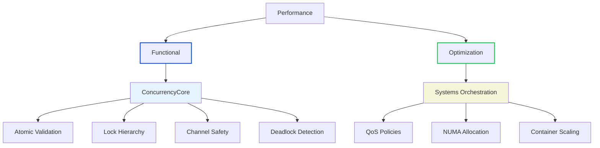
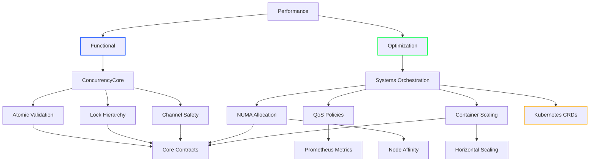

# Performance Subdomain

## 1. Purpose
Ensure concurrency system correctness while optimizing resource utilization through:

### Functional Requirements (Mandatory)
1. **Core Validation**
   - Atomic operation validation (alignment/barriers)
   - Lock hierarchy enforcement (ConcurrencyCore)
   - Channel closure/stall detection
   - Deadlock detection integration
   
2. **Systems Integration**
   - ConcurrencyCore metrics pipeline
   - Systems Orchestration policy compliance
   - Container resource baseline metrics

### Operational Optimizations (Optional)
1. **Hardware Efficiency**
   - NUMA-aware lock/memory placement
   - CPU cache optimization
   - Memory access patterns

2. **Cluster Optimization** 
   - QoS-based worker prioritization
   - Dynamic channel buffer sizing
   - Container-aware goroutine scaling
   - Kubernetes policy enforcement

## 2. Architectural Alignment


## 2. Architectural Alignment


## 3. Interface Contracts
graph TD
    A[Performance] --> B[Functional]
    A --> C[Operational]
    
    B --> D[Atomic Validation]
    B --> E[Lock Hierarchy]
    B --> F[Channel Safety]
    
    C --> G[NUMA Policy]
    C --> H[QoS Classes]
    C --> I[Container Scaling]
    
    D --> J[ConcurrencyCore]
    E --> J
    F --> J
    G --> K[Systems Orchestration]
    H --> K
    I --> K
```

## 3. Interface Contracts (Simplified)

### Mandatory Functional Interfaces
```go
// Core correctness validations from ConcurrencyCore
type AtomicValidator interface {
    ValidateAlignment(addr uintptr) error 
    VerifyMemoryOrder(accessType string) error
    CheckBarrierUsage() []BarrierViolation
}

type LockAuditor interface {
    TrackAcquisition(lockID uintptr, stack []byte)
    VerifyHierarchy() error // From ConcurrencyCore.SUPPLEMENT-lockhierarchy
    DetectPotentialDeadlocks() []ConcurrencyCore.DeadlockPath
}

type ChannelValidator interface {
    VerifyClosure(ch chan interface{}) error
    DetectStalls(bufferThreshold int) []ChannelStall
}

### Optional Performance Optimizations  
```go
// Systems-integrated enhancements
type QoSEnforcer interface {
    ApplyNUMAPolicy(policy Systems.NUMAPolicy) error
    CheckResourceLimits(res Systems.ContainerResources) []QoSViolation
    ValidatePoolCompliance(pool PolicyTarget) []QoSViolation
    GetNUMAAffinity() Systems.NUMAPolicy
    WithSystemsProvider(provider Systems.Provider) QoSEnforcer
    CurrentQoSClass() Systems.QOSLevel
    ApplyBurstCredit(credits int) error
    GetViolationHistory() []QoSViolation
}

// Systems-integrated implementation with full policy enforcement
type SystemsQoS struct {
    provider Systems.Provider
}

func (s *SystemsQoS) ApplyThreadPolicy(pool PolicyTarget) error {
    limits := s.provider.GetResourceLimits()
    numa := s.provider.GetNUMAPolicy()
    lockPolicy := s.provider.GetLockPolicy()
    
    violations := make([]QoSViolation, 0)
    
    // Apply NUMA affinity
    if err := pool.SetNUMAffinity(numa); err != nil {
        violations = append(violations, QoSViolation{
            Type:       "NUMA",
            Message:    err.Error(),
            Severity:   Systems.SeverityCritical,
            ResourceID: pool.GetID(),
        })
    }
    
    // Validate worker counts
    if pool.CurrentStats().Workers > limits.MaxWorkers {
        violations = append(violations, QoSViolation{
            Type:       "Workers",
            Message:    fmt.Sprintf("%d workers exceeds limit %d", 
                        pool.CurrentStats().Workers, limits.MaxWorkers),
            Severity:   Systems.SeverityHigh,
            ResourceID: pool.GetID(),
        })
    }
    
    // Validate queue depth
    if pool.CurrentStats().QueueDepth > limits.MaxQueueDepth {
        violations = append(violations, QoSViolation{
            Type:       "QueueDepth",
            Message:    fmt.Sprintf("%d queue depth exceeds limit %d",
                        pool.CurrentStats().QueueDepth, limits.MaxQueueDepth),
            Severity:   Systems.SeverityMedium,
            ResourceID: pool.GetID(),
        })
    }
    
    if len(violations) > 0 {
        return NewQoSError("policy violations detected", violations)
    }
    return nil
}

type NUMACoordinator interface {
    GetAffinity() Systems.NUMAPolicy
    Pin(resource interface{}, node int) error
    ReportCrossNode(accessType string) int
}

type ContainerScaler interface {
    CalculateWorkerPool(baseSize int) int
    AdjustGOGC(currentUtilization float64) int
    ReportPressureLevel() Systems.PressureLevel
}

// Integrated with Systems Orchestration
type SystemsProvider interface {
    GetQoSPolicy() Systems.QoSPolicy
    GetNUMAPolicy() Systems.NUMAPolicy
    ReportAnomaly(metric string, value float64)
    GetContainerContext() Systems.ContainerContext
}

// Simplified from legacy C++ Thread.cpp metrics
type LegacyMetricsAdapter interface {
    ReportCppThreadMetrics(map[string]uint64)
    GetHistogram(name string) Histogram
}
```

## 4. Migration Priorities

### Critical Functional Paths
1. Atomic operation validation
2. Lock hierarchy verification
3. Channel closure safety

### Initial Optimizations
1. QoS class-aware worker pools
2. NUMA-local lock allocation
3. Container CPU-aware goroutine scaling

## 5. Systems Integration

```go
// Implemented by Systems Orchestration
type SystemsProvider interface {
    GetQoSPolicy() Systems.QoSPolicy
    GetNUMAPolicy() Systems.NUMAPolicy 
    GetLockPolicy() Systems.LockPolicy
    GetContainerContext() Systems.ContainerContext
    ReportAnomaly(metric string, value float64)
    GetClusterCoordinator() Systems.ClusterCoordinator
    GetDeadlockStrategy() Systems.DeadlockResolution
    GetPressureHandler() Systems.PressureHandler
}

// Matches Systems Orchestration INTERFACES.md
type ResourceLimit struct {
    CPUMillicores int
    MemoryMB      int
    MaxLocks      int       
    MaxGoroutines int       
    QoSLevel      Systems.QOSLevel  
    NUMAffinity   Systems.NUMAPolicy
}
```
