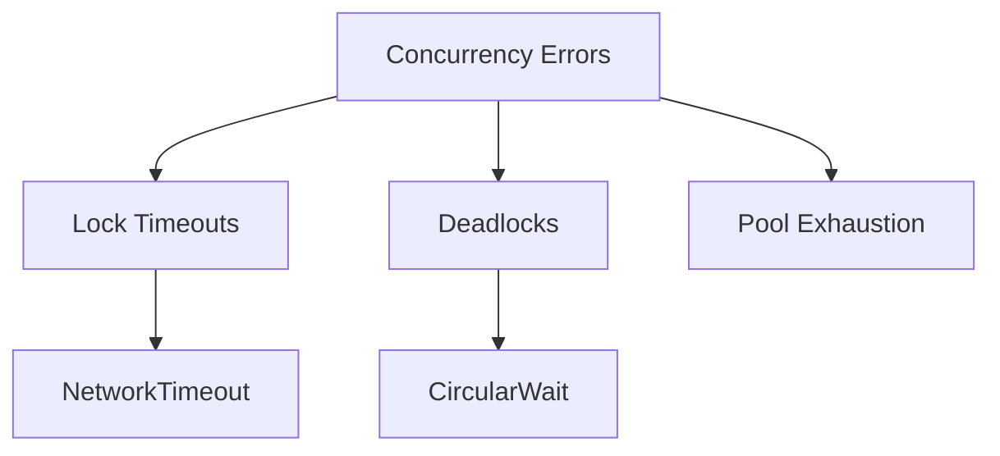

# Error Handling Subdomain

## 1. Purpose
Maintain thread safety and error contract compatibility while migrating from C++ exceptions to Go's error model.

## 2. Error Taxonomy



## 3. Interface Contracts

### Error Interfaces
```go
type ConcurrencyError interface {
    error
    IsRecoverable() bool
    Context() map[string]interface{}
    // Systems integration
    WithSystemsProvider(provider Systems.Provider) ConcurrencyError
    GetNUMAPolicy() Systems.NUMAPolicy
    KubernetesContext() *K8sErrorContext
}

type DeadlockDetector interface {
    Monitor(resources []ResourceID) error
    Report() []Deadlock
    AddResolver(resolver DeadlockResolver)
    // Systems integration
    ApplyClusterPolicy(policy Systems.DeadlockPolicy)
    GetKubernetesCRD() Systems.DeadlockCRD
    WithQoSClass(qos Systems.QOSLevel) DeadlockDetector
}

// Expanded error type with Systems integration
type ConcurrencyErrorStruct struct {
    Code           Systems.ErrorCode
    Message        string  
    Resource       string
    Stack          []byte
    NUMANode       int
    QoSClass       Systems.QOSLevel
    SystemsContext Systems.ErrorContext
    KubernetesContext *K8sErrorContext // From Systems orchestration
    RetryPolicy    Systems.RetryConfig
}

type K8sErrorContext struct {
    Pod            string
    Node           string
    Namespace      string
    Deployment     string
    Timestamp      time.Time
    QoSClass       Systems.QOSLevel
    NUMAAffinity   Systems.NUMAPolicy
    OwnerReference string // From Systems orchestration
}
```

### Recovery Contracts
```go
type PanicHandler interface {
    Recover(ctx context.Context, fn func())
    RecoverWithRestart(ctx context.Context, fn func(), restartPolicy Policy)
    // Systems integration
    ReportPanicToSystems(stack []byte) 
    GetRecoveryConfig() Systems.RecoveryProfile
    WithNUMANode(node int) PanicHandler
}

type CircuitBreaker interface {
    Execute(func() error) error
    State() CircuitState
    Reset()
    // Systems integration
    WithQoSBackoff(qos Systems.QOSLevel) CircuitBreaker
    GetBreakerMetrics() Systems.CircuitMetrics
    ApplyClusterPolicy(policy Systems.CircuitPolicy)
}

// Matches Systems Orchestration INTERFACES.md
type SystemsProvider interface {
    // Policy interfaces
    GetDeadlockStrategy() Systems.DeadlockResolution
    GetNUMAPolicy() Systems.NUMAPolicy
    GetQoSPolicy() Systems.QoSPolicy
    GetRecoveryProfile() Systems.RecoveryProfile
    
    // Resource awareness
    GetContainerContext() Systems.ContainerContext
    GetStealMetrics() Systems.StealMetrics
    GetTopologyHints() Systems.TopologyHints
    
    // Cluster operations
    ReportKubernetesEvent(event Systems.KubernetesEvent) error
    GetContainerOptimizer() Systems.ContainerOptimizer
    GetPressureHandler() Systems.PressureHandler
    
    // Monitoring integration
    ReportNUMAAccess(metric Systems.NUMAMetric)
    RecordPolicyViolation(violation Systems.PolicyViolation)
}
```

## 4. NUMA-Aware Error Handling

```go
// Example integrating Systems orchestration policies
func handleNUMAAccessError(err NUMAAccessError, systems SystemsProvider) error {
    policy := systems.GetNUMAPolicy()
    metrics := systems.GetStealMetrics()
    
    if slices.Contains(policy.AllowedNodes, err.TargetNode) {
        if metrics.CurrentSteals < policy.MaxSteals {
            // Attempt allowed cross-node access
            return tryNUMAAccess(err.TargetNode)
        }
        return fmt.Errorf("steal threshold exceeded: %d/%d", 
            metrics.CurrentSteals, policy.MaxSteals)
    }
    
    // Fallback to Systems-defined strategy
    switch policy.FallbackStrategy {
    case Systems.NUMAFallbackAnyNode:
        return tryNUMAAccess(-1) // Any node
    case Systems.NUMAFallbackWait:
        return waitForLocalResource(err.ResourceType)
    default:
        return systems.GetContainerOptimizer().RelocateResource(
            err.ResourceType, 
            systems.GetContainerContext().ID)
    }
}
```

## 5. Supplemental References
1. **SUPPLEMENT-errorhandling.md** - Core panic/deadlock handling
2. **SUPPLEMENT-numa.md** - NUMA-specific error types and resolution
3. **SUPPLEMENT-context-propagation.md** - Cross-domain context rules

## 5. Migration Strategy

### Exception Mapping
| C++ Exception        | Go Error               | Recovery Pattern |
|----------------------|------------------------|------------------|
| ThreadException      | ErrThreadStart         | Retry 3x         |
| MutexTimeout         | ErrLockTimeout         | Backoff          |  
| DeadlockDetected     | ErrDeadlock            | Full restart     |

### Critical Code Paths
1. Network packet processing
2. AI decision tree traversal
3. Database connection pooling
