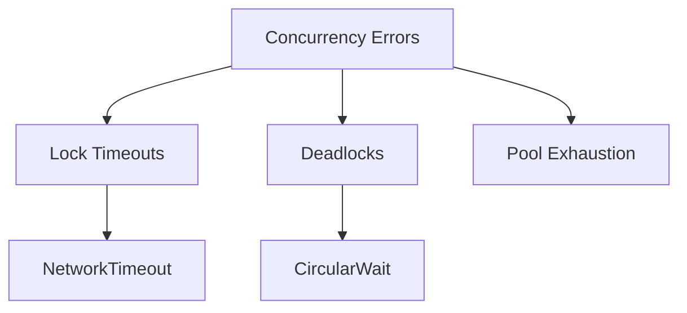

# Error Handling Subdomain

## 1. Purpose
Maintain thread safety and error contract compatibility while migrating from C++ exceptions to Go's error model.

## 2. Error Taxonomy



## 3. Interface Contracts

### Error Interfaces
```go
type ConcurrencyError interface {
    error
    IsRecoverable() bool
    Context() map[string]interface{}
}

type DeadlockDetector interface {
    Monitor(resources []ResourceID) error
    Report() []Deadlock
    AddResolver(resolver DeadlockResolver)
}
```

### Recovery Contracts
```go
type PanicHandler interface {
    Recover(ctx context.Context, fn func())
    RecoverWithRestart(ctx context.Context, fn func(), restartPolicy Policy)
}

type CircuitBreaker interface {
    Execute(func() error) error
    State() CircuitState
    Reset()
}
```

## 4. Migration Strategy

### Exception Mapping
| C++ Exception        | Go Error               | Recovery Pattern |
|----------------------|------------------------|------------------|
| ThreadException      | ErrThreadStart         | Retry 3x         |
| MutexTimeout         | ErrLockTimeout         | Backoff          |  
| DeadlockDetected     | ErrDeadlock            | Full restart     |

### Critical Code Paths
1. Network packet processing
2. AI decision tree traversal
3. Database connection pooling
