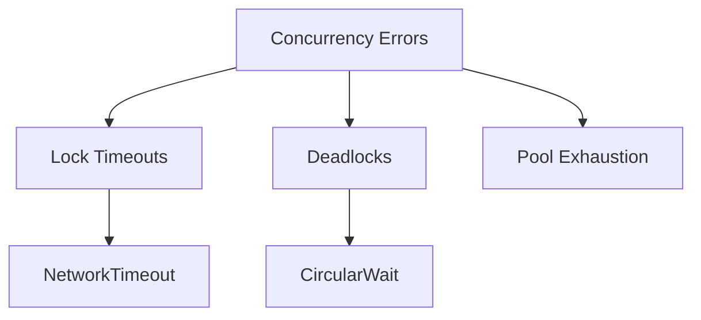

# Error Handling Subdomain

## 1. Purpose
Maintain thread safety and error contract compatibility while migrating from C++ exceptions to Go's error model.

## 2. Error Taxonomy



## 3. Interface Contracts

### Error Interfaces
```go
type ConcurrencyError interface {
    error
    IsRecoverable() bool
    Context() map[string]interface{}
    // Systems integration
    WithSystemsProvider(provider Systems.Provider) ConcurrencyError
    GetNUMAPolicy() Systems.NUMAPolicy
    KubernetesContext() *K8sErrorContext
}

type DeadlockDetector interface {
    Monitor(resources []ResourceID) error
    Report() []Deadlock
    AddResolver(resolver DeadlockResolver)
    // Systems integration
    ApplyClusterPolicy(policy Systems.DeadlockPolicy)
    GetKubernetesCRD() Systems.DeadlockCRD
    WithQoSClass(qos Systems.QOSLevel) DeadlockDetector
}

// Expanded error type with Systems integration
type ConcurrencyErrorStruct struct {
    Code        Systems.ErrorCode
    Message     string  
    Resource    string
    Stack       []byte
    NUMANode    int
    QoSClass    Systems.QOSLevel
    // Systems domain handles container context
    SystemsContext Systems.ErrorContext
}

type K8sErrorContext struct {
    Pod         string
    Node        string
    Namespace   string
    Deployment  string
    Timestamp   time.Time
}
```

### Recovery Contracts
```go
type PanicHandler interface {
    Recover(ctx context.Context, fn func())
    RecoverWithRestart(ctx context.Context, fn func(), restartPolicy Policy)
    // Systems integration
    ReportPanicToSystems(stack []byte) 
    GetRecoveryConfig() Systems.RecoveryProfile
    WithNUMANode(node int) PanicHandler
}

type CircuitBreaker interface {
    Execute(func() error) error
    State() CircuitState
    Reset()
    // Systems integration
    WithQoSBackoff(qos Systems.QOSLevel) CircuitBreaker
    GetBreakerMetrics() Systems.CircuitMetrics
    ApplyClusterPolicy(policy Systems.CircuitPolicy)
}

// Matches Systems Orchestration INTERFACES.md
type SystemsProvider interface {
    GetDeadlockStrategy() Systems.DeadlockResolution
    GetPressureHandler() Systems.PressureHandler
    GetRecoveryConfig() Systems.RecoveryProfile
    ReportKubernetesEvent(event Systems.KubernetesEvent) error
    GetContainerDiagnostics() Systems.ContainerContext
    GetNUMAPolicy() Systems.NUMAPolicy
    GetQoSPolicy() Systems.QoSPolicy
}
```

## 4. Migration Strategy

### Exception Mapping
| C++ Exception        | Go Error               | Recovery Pattern |
|----------------------|------------------------|------------------|
| ThreadException      | ErrThreadStart         | Retry 3x         |
| MutexTimeout         | ErrLockTimeout         | Backoff          |  
| DeadlockDetected     | ErrDeadlock            | Full restart     |

### Critical Code Paths
1. Network packet processing
2. AI decision tree traversal
3. Database connection pooling
