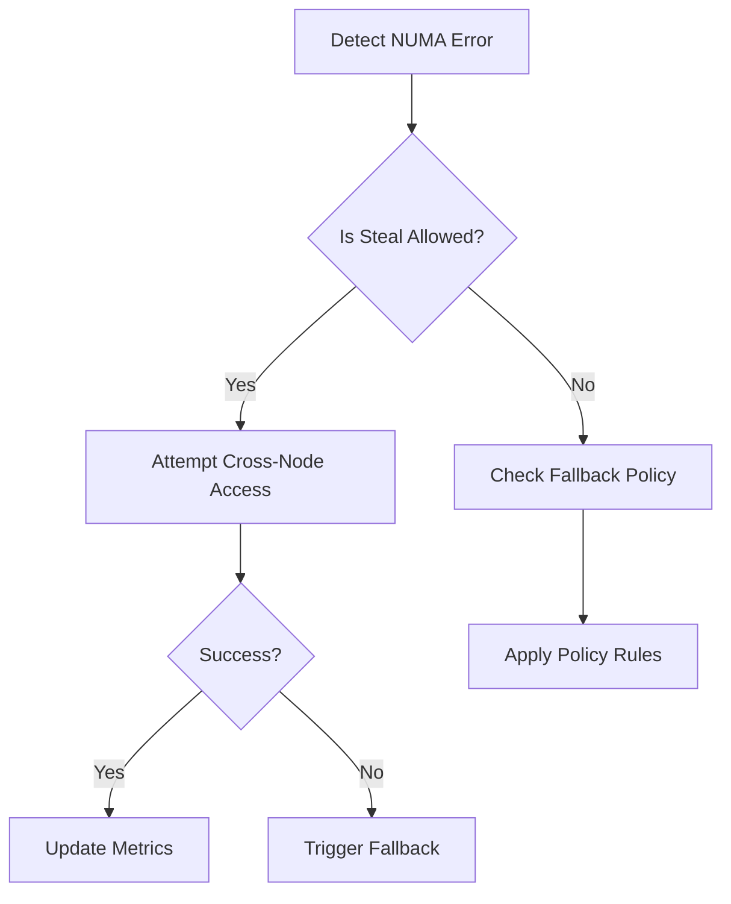

# NUMA-Aware Error Handling Supplement

## 1. NUMA Error Types
```go
type NUMAAccessError struct {
    SourceNode    int
    TargetNode    int
    ResourceType  string
    Distance      int
    QoSClass      Systems.QOSLevel
    AllowedNodes  []int
}

func (e NUMAAccessError) Error() string {
    return fmt.Sprintf("NUMA node %d cannot access %s on node %d (distance %d)",
        e.SourceNode, e.ResourceType, e.TargetNode, e.Distance)
}

type NUMAStealError struct {
    StolenFromNode int
    CurrentNode    int
    ResourceID     string
    StealType      Systems.StealType
}

type NUMAPolicyError struct {
    RequiredPolicy   Systems.NUMAPolicy
    ActualPlacement Systems.NUMAPlacement
    ViolationType   Systems.PolicyViolationType
}
```

## 2. Resolution Strategies


## 3. Systems Integration Contracts
```go
type NUMAErrorHandler interface {
    Handle(err error) (retry bool, adjustedNode int)
    RecordSteal(metric Systems.StealMetric) 
    WithSystemsContext(provider Systems.Provider) NUMAErrorHandler
    GetErrorMetrics() Systems.NUMAErrorMetrics
    // Matches Systems Orchestration DOMAIN.md policies
    ApplyCRDPolicy(policy Systems.NUMAPolicyCRD) error
}
```

## 4. Kubernetes CRD Integration
```yaml
# Example NUMA-aware concurrency policy CRD
apiVersion: concurrency.gokore.io/v1alpha1
kind: NUMAPolicy
metadata:
  name: ai-worker-policy
spec:
  numaTopology:
    allowedNodes: [0,1]
    maxCrossAccess: 15%
  qosClasses:
    - name: high-priority
      stealAllowed: true
      maxSteals: 5
    - name: default
      stealAllowed: false
  failurePolicies:
    - errorType: NUMAAccessViolation
      action: relocatePod
    - errorType: StealLimitExceeded  
      action: throttleWorker
```

See [Systems Orchestration DOMAIN.md](../../05-Systems/06-Orchestration/DOMAIN.md) for full policy definitions.
