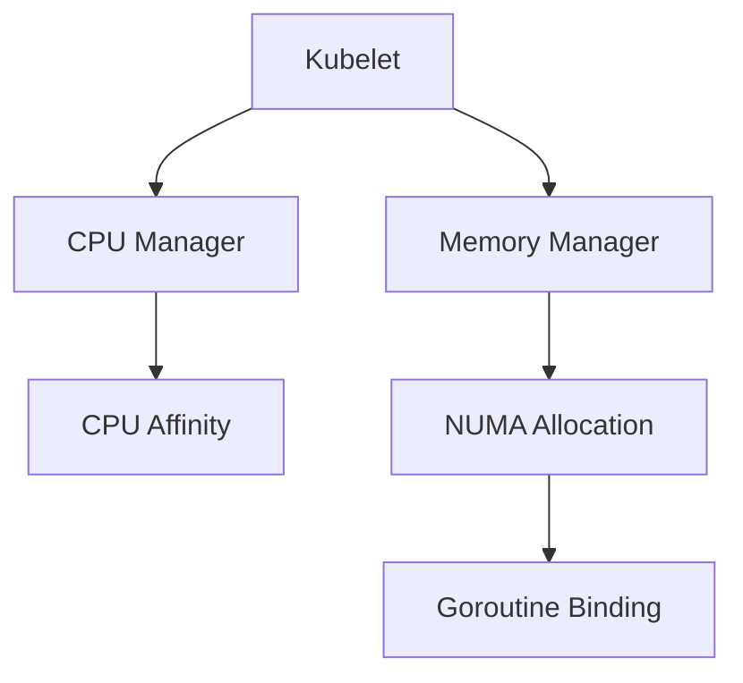

# Container Integration Subdomain

## 1. Purpose
Adapt concurrency patterns for cloud-native environments while maintaining compatibility with legacy threading expectations.

## 2. Orchestration Integration



## 3. Interface Contracts

### Container Interfaces
```go
type ContainerIntegrator interface {
    SetCPUShare(percent int) error
    ReportLiveness() HealthStatus
    BindNUMA(node int) error
}

type OrchestrationHook interface {
    PreStop() error
    PostStart() error
    ReadyCheck() bool
}
```

### Resource Contracts
```go
type ResourceMonitor interface {
    WatchCPUUtilization() <-chan UtilizationReport
    MemoryPressureLevel() PressureLevel
    Throttle(pressure PressureLevel) error
}

type NodeAffinity interface {
    PreferredNodes() []string
    RequiredArch() string
}
```

## 4. Migration Challenges

### Legacy Compatibility
| C++ Concept          | Container Pattern       | Risk |
|----------------------|-------------------------|------|
| Thread Affinity      | CPU Manager             | Over-provisioning |
| Stack Size           | Memory Limits           | OOM Kill          |
| Priority Inheritance | QoS Classes             | Preemption        |

### Critical Paths
1. Network packet processing isolation
2. AI decision tree CPU pinning
3. Database connection NUMA locality
