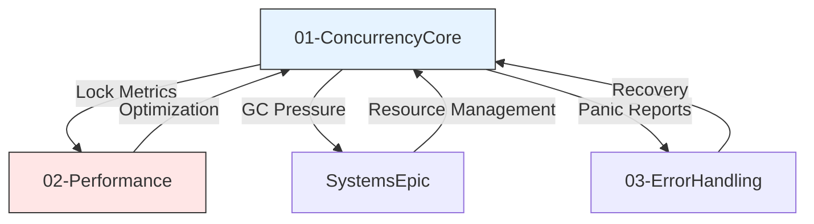

# goKore Concurrency Epic Domain Design

## 1. Purpose

DO NOT REMOVE: This is the domain model for the goKore Concurrency system, reimplementing C++ threading primitives in Go. This document serves as the highest level design for
concurrency management and details the subdomains and their core responsibilities. It also includes the relevant C++ files for each subdomain. This file DOES NOT contain any code

## 2. Subdomains

### 01-ConcurrencyCore Subdomain
**Core Responsibilities**
- Thread-safe memory model migration
- Goroutine-based task scheduling
- Channel-based synchronization
- Atomic reference counting
- Mutex/RWMutex wrappers

**Relevant C++ Files & Migration**
| File | Action | Go Approach |
|------|--------|-------------|
| `src/auto/XSTools/OSL/Threading/Mutex.*` | Completed | Replaced with sync.Mutex + context wrappers |
| `src/auto/XSTools/OSL/Threading/Thread.*` | Replace | Goroutines + sync.WaitGroup |
| `src/auto/XSTools/OSL/Threading/Atomic.*` | Wrap | atomic.Int/atomic.Bool |
| `src/auto/XSTools/OSL/Threading/Runnable.*` | Adapt | go func() with context |
| `src/auto/XSTools/OSL/Object.cpp` | Delete | Rely on GC + finalizers |

**Contracts/Interfaces**
```go
type MutexProvider interface {
    NewMutex() SyncMutex
    NewRWMutex() SyncRWMutex
    WithContext(ctx context.Context) ContextMutex
}

type Scheduler interface {
    Schedule(task Runnable, ctx context.Context) error
    WorkerPool(size int) TaskPool
    Metrics() SchedulerMetrics
    WithContext(ctx context.Context) Scheduler
}
```

### 02-Performance Subdomain
**Core Responsibilities**
- Goroutine scheduling analysis
- Channel contention metrics
- Mutex profiling
- GC tuning for C++ interop

**Relevant C++ Files & Migration**
| File | Action | Go Approach |
|------|--------|-------------|
| `src/auto/XSTools/OSL/Threading/MutexLocker.*` | Wrap | defer mutex.Unlock() |
| `src/auto/XSTools/OSL/Threading/ThreadPool.cpp` | Replace | Worker goroutine pools |
| `src/auto/XSTools/PathFinding/algorithm.cpp` | Adapt | Goroutine-safe pathfinding |
| `src/auto/XSTools/OSL/Threading/Win32/Thread.cpp` | Delete | Use runtime.LockOSThread |

**Contracts/Interfaces**
```go
type Profiler interface {
    TrackLock(waitNs int64)
    TrackGoroutine(start, end time.Time)
    ChannelContention(ch chan interface{})
}

type Optimizer interface {
    TuneGC(targetPause time.Duration)
    BalanceWorkers(pool Pool, metrics PoolMetrics)
}
```

### 03-ErrorHandling Subdomain
**Core Responsibilities**
- Concurrency panic recovery
- Context cancellation propagation
- Deadlock detection
- Timeout enforcement
- Error channel patterns

**Relevant C++ Files & Migration**
| File | Action | Go Approach |
|------|--------|-------------|
| `src/auto/XSTools/OSL/Exception.*` | Adapt | errors.Is/errors.As |
| `src/auto/XSTools/OSL/Threading/MutexLocker.h` | Replace | defer-based cleanup |
| `src/auto/XSTools/OSL/Threading/Unix/Thread.cpp` | Delete | Use context cancellation |
| `src/auto/XSTools/OSL/Threading/Distfiles` | Update | Remove migrated files |

**Contracts/Interfaces**
```go
type ConcurrencyErrorHandler interface {
    RecoverPanic(ctx context.Context)
    DeadlineExceeded(err error) bool
    WrapLock(lock sync.Locker) SafeLocker
}

type DeadlockDetector interface {
    Monitor(resources []ResourceID)
    Report() []Deadlock
}
```


## 3. Migration Notes
1. **Lock Hierarchy** (NEW):
   - Strict acquisition order enforced via [SUPPLEMENT-lockhierarchy.md](./SUPPLEMENT-lockhierarchy.md)
   - Runtime verification integrated with container metadata
   - Visualizer generates mermaid/graphviz/prometheus outputs
   - Kubernetes CRD-backed policy enforcement (see supplement)
   - Systems domain integration:
     ```go
     type LockPolicyCRD struct {
         QoSClass      Systems.QOSLevel
         NUMAAffinity  Systems.NUMAPolicy
         MaxHoldTime   time.Duration
         RetryPolicy   Systems.RetryConfig
     }
     ```
   - Enforcement mechanisms:
     - Admission controller hooks
     - Namespaced policy inheritance
     - Priority inversion protection


3. **Dropped Components**:
   | Component          | Reason                  | Replacement            |
   |--------------------|-------------------------|------------------------|
   | Win32 CRITICAL_SEC | Container incompatible | sync.Mutex             |
   | UI Event Threads   | Headless operation      | Channel-based events   |
   | Manual Refcounting | GC integration          | Removed - Rely entirely on GC |

## 4. Domain Architecture


## 5. Cross-Domain Integration
- **Network Epic**: Channel-based packet pipelines
- **AI Epic**: Goroutine worker pools
- **Systems Epic**: Container resource limits
