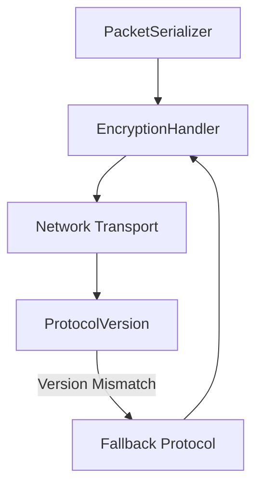

# Protocol Handling Subdomain

## Core Responsibilities
- Packet structure definitions and validation
- Message serialization/deserialization  
- Network byte order management
- Protocol version negotiation
- Packet encryption/decryption workflows

## Relevant OpenKore Files
- `src/Network/Send.pm`: Packet construction and sending logic
- `src/Network/Receive.pm`: Packet parsing and handling
- `src/Network/MessageTokenizer.pm`: Message fragmentation/defragmentation
- `src/Network/PacketParser.pm`: Packet analysis and validation

## Supplemental Files
- `SUPPLEMENT-PacketStructures.md`: Binary layouts for core protocol messages
- `SUPPLEMENT-Encryption.md`: Cryptography specifications for different versions
- `SUPPLEMENT-ClientVersions.md`: Supported client version matrix

## Contracts/Interfaces
```go
// Version negotiation strategy table reference: SUPPLEMENT-ClientVersions.md#version-negotiation
type ProtocolVersion interface {
    Negotiate(clientVersion, serverVersion uint32) (negotiatedVersion uint32, err error)
    Supports(feature ProtocolFeature) bool
    FallbackStrategy() VersionFallback
    ErrorCode() ProtocolError
}

// Binary layout specifications: SUPPLEMENT-PacketStructures.md
type PacketSerializer interface {
    Serialize(pkt Packet) ([]byte, error)
    Deserialize(raw []byte) (Packet, error)
    ValidateCRC(pkt []byte) bool
    MinSize() int
}

// Algorithm specifications: SUPPLEMENT-Encryption.md#algorithm-selection 
type EncryptionHandler interface {
    Encrypt(raw []byte, algorithm EncryptionType) ([]byte, error)
    Decrypt(encrypted []byte, algorithm EncryptionType) ([]byte, error)
    SetAlgorithm(priorityOrder []EncryptionType) error
    RotateKeys(interval time.Duration)
}
```

## Architecture

