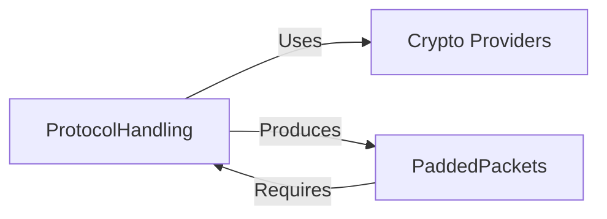

# Protocol Handling Implementation State

## Implementation Tasks
1. [ ] **Base Packet Structure**
2. [ ] **Encryption Workflows**
   - [ ] Rijndael implementation
   - [ ] FEAL-4/8 support
3. [ ] **Version Negotiation**
   - [ ] Basic version detection
   - [ ] Fallback protocol support

## Critical Dependencies

