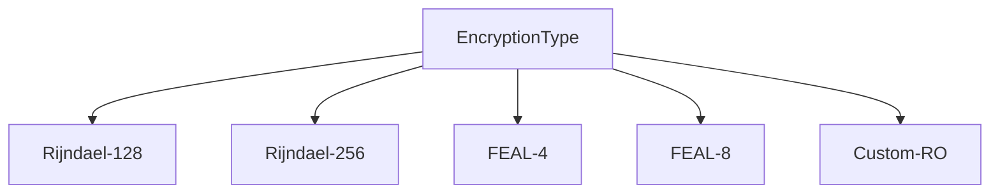

# Protocol Encryption Specifications

## Supported Algorithms


## Key Rotation Schedule
| Algorithm       | Recommended Rotation |
|-----------------|----------------------|
| Rijndael-128    | 30 minutes           |
| Rijndael-256    | 60 minutes           |
| FEAL-4          | 15 minutes           |
| FEAL-8          | 30 minutes           |
| Custom-RO       | 60 minutes           |

## Error Codes
```go
type EncryptionError int

const (
    ErrInvalidBlockSize EncryptionError = iota + 1
    ErrKeyExpired
    ErrAlgorithmDisabled
    ErrPacketChecksum
    ErrVersionMismatch
)
```

## Handshake Sequence
```text
1. ClientHello (send supported algorithms)
2. ServerHello (chosen algorithm + initial vector)
3. KeyExchange (client sends encrypted session key)
4. HandshakeVerify (both validate encryption)
```
