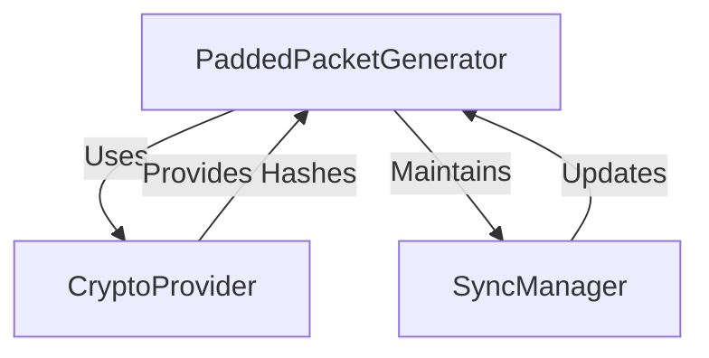

# Padded Packets Subdomain

## Core Responsibilities
- Server-specific padded packet generation
- Cryptographic padding algorithms  
- Packet length obfuscation
- Sync counter management
- Client hash validation
- Account ID synchronization

## Relevant OpenKore Files
- `src/Network/PaddedPackets.pm`: Core implementation
- `src/auto/XSTools/PaddedPackets/Algorithms/snefru.*`: Hash algorithm
- `src/auto/XSTools/PaddedPackets/typedefs.h`: Data types

## Supplemental Files
- `SUPPLEMENT-PaddingAlgorithms.md`: Server-specific padding implementations
- `SUPPLEMENT-SyncManagement.md`: Counter synchronization mechanisms
- `SUPPLEMENT-HashFormats.md`: Client hash generation specifications

## Contracts/Interfaces
```go
type PaddedPacketGenerator interface {
    GenerateSitStand(sit bool) []byte
    GenerateAttack(target uint32, flags byte) []byte 
    GenerateSkill(skillID uint16, lvl byte, target uint32) []byte
    ValidatePadding(packet []byte) bool
}

type SyncManager interface {
    GetMapSync() uint32
    GetAccountSync() uint32
    IncrementCounters()
}
```

## Architecture

