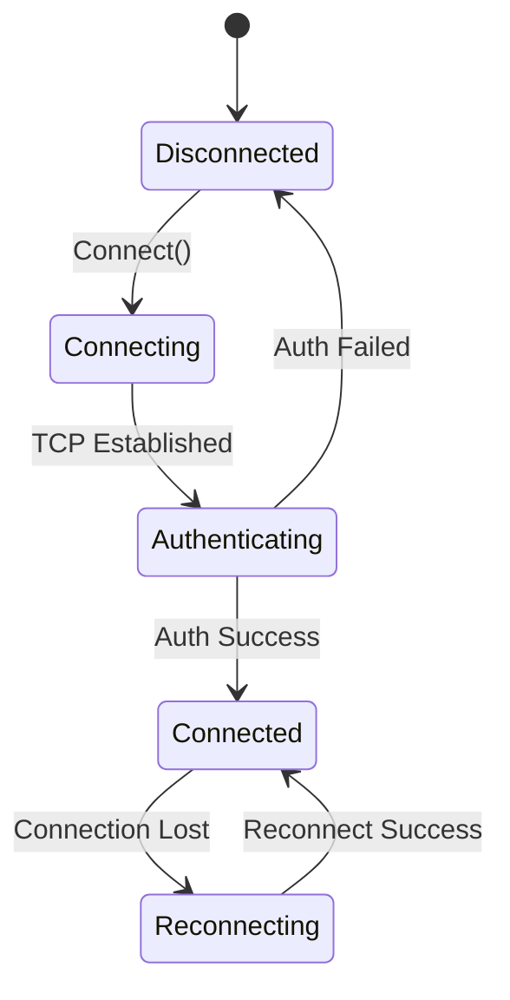

# Session Management Subdomain

## Core Responsibilities
- Connection state machine
- Authentication workflows
- Server type detection  
- Session persistence/recovery
- Reconnection logic

## Relevant OpenKore Files
- `src/Network.pm`: State constants
- `src/Network/ClientReceive.pm`: Client message handling
- `src/auto/XSTools/OSL/Exception.*`: Error handling

## Supplemental Files
- `SUPPLEMENT-AuthWorkflows.md`: Authentication sequence diagrams
- `SUPPLEMENT-SessionRecovery.md`: Session persistence format specifications
- `SUPPLEMENT-ErrorCodes.md`: Connection error code definitions

## Contracts/Interfaces
```go
type SessionManager interface {
    Connect(endpoint string) error
    Reconnect() error
    GetState() ConnectionState
    HandleHandshake() error
}

type AuthHandler interface {
    Authenticate(credentials AuthCredentials) (AuthToken, error)
    ValidateToken(token AuthToken) bool
}
```

## State Machine

