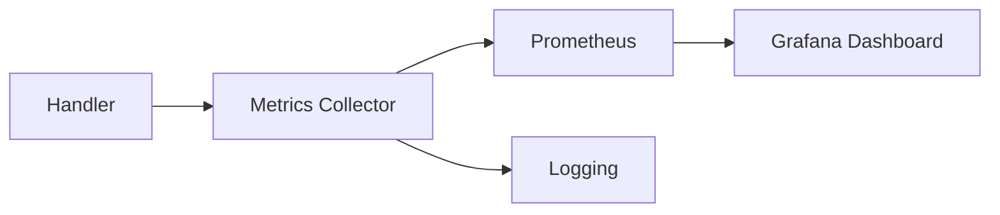

# Reconciliation Metrics

## Core Metrics

```protobuf
message MetricReport {
  message ConflictCounter {
    uint32 data_conflicts = 1;
    uint32 priority_conflicts = 2;
    uint32 sequence_conflicts = 3;
    uint32 semantic_conflicts = 4;
  }
  
  message ResolutionHistogram {
    uint32 automatic = 1;
    uint32 manual = 2;
    uint32 quarantined = 3;
    uint32 rolled_back = 4;
  }

  ConflictCounter conflicts = 1;
  ResolutionHistogram resolutions = 2;
  map<uint32, uint64> version_deltas = 3; // entity_type -> drift
  map<uint32, uint32> quarantine_counts = 4; // reason -> count
  uint64 avg_resolution_ms = 5;
  uint32 active_retries = 6;
}

## Monitoring Integration
- Metrics exposed via OpenMetrics endpoint on :9100/metrics
- AlertManager integration for:
  - conflict_rate > 5/sec (per entity type)
  - avg_resolution_time > 500ms
  - quarantine_capacity > 90%
- Grafana dashboard includes:
  - Conflict type breakdown
  - Resolution type ratios
  - Version drift heatmap
  - Quarantine reason distribution

## Monitoring Integration


## Alerting Rules
- High conflict rate (>5/sec)
- Long quarantine duration (>5min)
- Version drift threshold (>10 versions)
