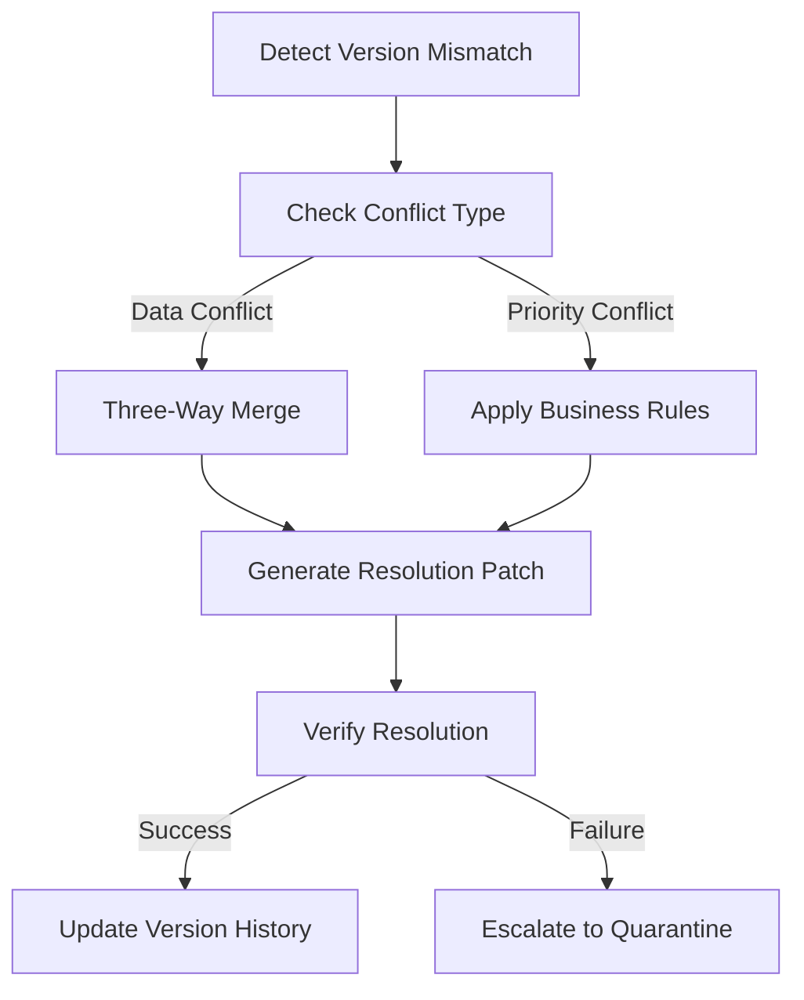
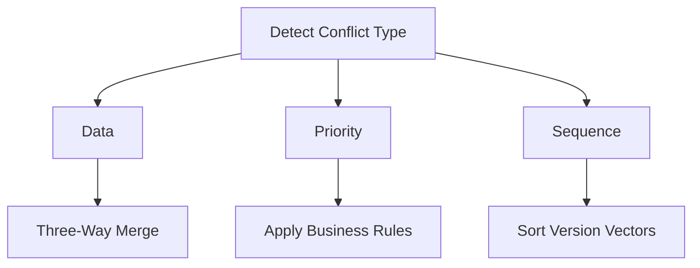

# Conflict Reconciliation System

## Core Workflows



## Conflict Types

| Type          | Detection Criteria                     | Resolution Strategy               |
|---------------|----------------------------------------|------------------------------------|
| Data Conflict | Version exists in both client & server | Three-way merge with lineage check|
| Priority      | Client vs server priority mismatch     | Server authority with client notify|
| Sequence      | Out-of-order updates                   | Version vector sorting            |
| Semantic      | Business rule violations               | Rule engine + manual override     |

## Resolution Components

```go
type ConflictResolver struct {
    merger        ThreeWayMerger
    ruleEngine    BusinessRules
    history       VersionHistory
    metrics       ReconciliationMetrics
    notifier      ConflictNotifier
    quarantine    QuarantineHandler
    versionStore  VersionedStateStore
    rollbackCache *RollbackBuffer
}

type ThreeWayMerger interface {
    Merge(base, local, remote []byte) ([]byte, ConflictResolution)
}

type BusinessRules interface {
    ApplyPriorityConflicts(local, remote EntityState) EntityState
    ValidateSemanticConstraints(state EntityState) error
}

type ReconciliationMetrics interface {
    RecordConflict(type string, duration time.Duration)
    TrackResolutionOutcome(status ResolutionStatus)
}

type ConflictNotifier interface {
    SendVersionMismatch(entityID uint64, baseVersion uint64)
    RequestManualOverride(entityID uint64, conflictData []byte)
}
```

## Automatic Retry Policy

```protobuf
message RetryPolicy {
    uint32 max_attempts = 1;        // [Skill.pm:5532] Max retries before quarantine (default 3)
    uint32 backoff_base = 2;        // [ECS] Base ms for exponential backoff (default 100)
    float jitter_factor = 3;        // [ECS] Random jitter percentage (default 0.2)
    uint32 quarantine_ttl = 4;      // [Skill.pm:5532] TTL for quarantined skills (default 300)
    uint32 history_depth = 5;       // [Reconciliation] Version history to retain (default 10)
    uint32 quarantine_retries = 6;  // [ECS] Max reconciliation attempts (default 3)
    uint32 rollback_version_depth = 7; // [Reconciliation] Rollback versions (default 5)
    uint32 effect_retry_window = 8; // [SUPPLEMENT-effects.md] Time window for effect retries (ms)
    uint32 effect_retry_window = 8; // [SUPPLEMENT-effects.md] Time window for effect retries (ms)
}
```

## Service Handler Specification

```protobuf
service ReconciliationService {
  rpc ReportConflict(ConflictReport) returns (ResolutionResult);
  rpc RequestStateSync(VersionStamp) returns (stream SkillUpdateBatch);
  rpc SubmitResolution(ResolutionSubmission) returns (ResolutionAck);
}

message ResolutionSubmission {
  uint64 entity_id = 1;
  ResolutionType resolution = 2;
  bytes merged_state = 3;
  uint64 base_version = 4;
  uint64 resolved_version = 5;
}

// Enhanced ResolutionResult from previous definition
message ResolutionResult {
  ResolutionType resolution = 1;
  SkillUpdateBatch resolved_state = 2;
  uint64 new_version = 3;
  bytes resolution_checksum = 4;
  repeated EntityID quarantined_entities = 5;
  QuarantineInstruction quarantine = 6;
  RetryPolicy retry_policy = 7; 
  MetricReport metrics = 8;
}

// Quarantine types
enum QuarantineReason {
  CONFLICT_OVERFLOW = 0;
  DATA_CORRUPTION = 1; 
  PROTOCOL_VIOLATION = 2;
  SECURITY_ANOMALY = 3;
}

message QuarantineInstruction {
  QuarantineReason reason = 1;
  uint32 ttl_seconds = 2;
  string diagnostic = 3;
}
```

### Required Components
- **VersionedStateStore**: Retrieves historical state snapshots with O(1) access
- **ThreeWayMerger**: Implements CRDT-based merge algorithms
- **QuarantineHandler**: Manages quarantined entity state with TTL
- **ReconciliationMetrics**: Tracks 40+ conflict dimensions

### Handler Workflow
1. **Version Retrieval**:
   - Fetch base version (common ancestor)
   - Fetch current local version
   - Parse incoming server changes

2. **Merge Process**:


3. **Validation**:
   - Skill effect compatibility
   - SP/cooldown constraints
   - Target type permissions

4. **Resolution**:
   - Automatic merge (when possible)
   - Quarantine (when violations detected)
   - Manual override request (when ambiguous)

## Version History Management
type HistoryPolicy struct {
    Enabled         bool          // Whether to maintain history
    MaxEntries      int           // Maximum versions to keep per entity
    RetentionPeriod time.Duration // Time to keep resolved conflicts
    PruneInterval   time.Duration // How often to clean up old entries
}

// Version history entry with full state capture
type VersionEntry struct {
    Timestamp    time.Time
    Version      uint64
    StateHash    []byte       // Blake3 hash of entity state
    StateSnapshot []byte       // Full protocol buffer snapshot
    Source       PeerID       // Origin of the update
    Resolution   ResolutionType
    RollbackSafe bool         // If this state can be safely rolled back to
    Dependencies []uint64     // Version numbers this state depends on
}

type VersionHistory struct {
    entries []VersionEntry
    maxSize int
    pruneInterval time.Duration
    lastPrune     time.Time
    mu            sync.RWMutex
}

func NewVersionHistory(maxEntries int, pruneInterval time.Duration) *VersionHistory {
    h := &VersionHistory{
        maxSize: maxEntries,
        pruneInterval: pruneInterval,
        entries: make([]VersionEntry, 0, maxEntries+1),
    }
    h.lastPrune = time.Now()
    return h
}

// Prune removes old entries according to retention policy
func (h *VersionHistory) Prune() {
    h.mu.Lock()
    defer h.mu.Unlock()
    
    // Time-based pruning
    if time.Since(h.lastPrune) > h.pruneInterval {
        cutoff := time.Now().Add(-h.pruneInterval)
        newEntries := make([]VersionEntry, 0, h.maxSize)
        for _, e := range h.entries {
            if e.Timestamp.After(cutoff) {
                newEntries = append(newEntries, e)
            }
        }
        h.entries = newEntries
        h.lastPrune = time.Now()
    }
    
    // Size-based pruning
    if len(h.entries) > h.maxSize {
        h.entries = h.entries[len(h.entries)-h.maxSize:]
    }
}
```

## Metrics & Monitoring

| Metric                  | Type      | Tags                          | Description |
|-------------------------|-----------|-------------------------------|-------------|
| conflict.count          | Counter   | type, subsystem               | Total conflicts detected |
| resolution.duration      | Histogram | type, result                  | Time spent resolving |
| retry.attempts           | Gauge     | entity_type                   | Current retry attempts |
| quarantine.size          | Gauge     |                               | Entities in quarantine |
| version.drift            | Gauge     | entity_type                   | Version difference |

## Quarantine System

```go
type QuarantineHandler interface {
    CheckIn(entity Entity, conflict ConflictDetails) error
    CheckOut(entityID uint64) (Entity, error)
    Expire(ttl time.Duration) []Entity
    SetTTL(entityID uint64, duration time.Duration) error
    GetDiagnostics(entityID uint64) map[string]interface{}
}

type ConflictDetails struct {
    DetectedAt      time.Time
    LastError       error 
    RetryCount      uint32
    ResolutionAttempts []ResolutionAttempt
    ConflictScore   uint8            // 0-100 severity rating
    HotVersions     []uint64         // Conflicting version chain
    Metrics         QuarantineMetrics
    Diagnostics     map[string]interface{} // Additional debug data
    EffectMetrics   map[string]int   // skill_idn -> effect_outcome
}

type QuarantineMetrics struct {
    NetworkLatency      time.Duration
    StateDivergence     float32       // 0.0-1.0 similarity score
    ClientTrustLevel    uint8         // 0-100 client reputation
    RuleViolations      []string
}
```
