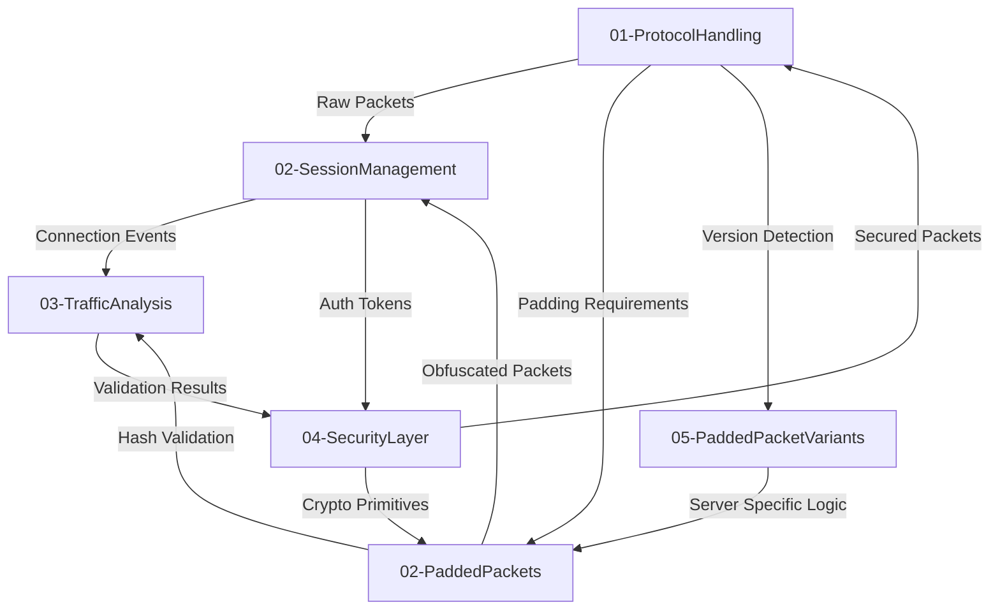
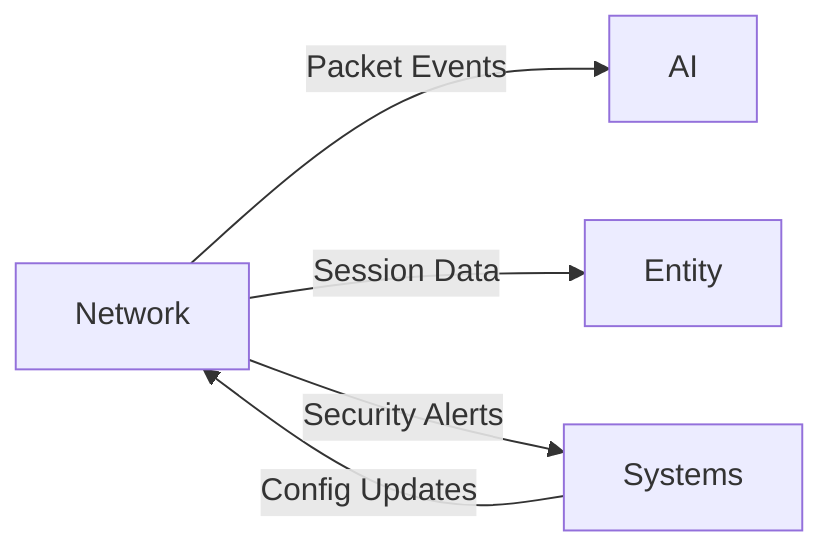

# goKore Network Epic Domain Design

## 1. Purpose

DO NOT REMOVE: This is the domain model for the goKore Network stack, a reimplementation of the perl-based OpenKore. This document serves as the highest level design for the network stack and details the subdomains and their core responsibilities. It also includes the openkore perl or C++ files that are relevant for each subdomain. This file DOES NOT contain any code, as that should be reserved for the subdomain models and their supplemental files. Instead it describes the high level architecture of the Network stack. Use Mermaid diagrams to illustrate your designs.

## 2. Subdomains
DO NOT REMOVE: This section details the subdomains that make up the Network domain. Each entry should include the title of the subdomain, core responsibilities of the subdomain, relevant openkore (perl or c++) files that are relevant for the subdomain, and any contracts, interfaces, or services that are needed. Do not include any code in this section.

### 01-ProtocolHandling

**Core Responsibilities** 
- Packet structure definitions and validation
- Message serialization/deserialization
- Network byte order management
- Protocol version negotiation
- Packet encryption/decryption workflows

**Relevant OpenKore Files**
- `src/Network/Send.pm`: Packet construction and sending logic
- `src/Network/Receive.pm`: Packet parsing and handling 
- `src/Network/PaddedPackets.pm`: Padded packet algorithms
- `src/auto/XSTools/PaddedPackets/Algorithms/snefru.*`: Hashing implementation

**Contracts/Interfaces**

### 02-PaddedPackets

**Core Responsibilities**
- Server-specific padded packet generation  
- Cryptographic padding algorithms
- Packet length obfuscation
- Sync counter management
- Attack pattern masking
- Client hash generation
- Account ID synchronization

**Relevant OpenKore Files**
- `src/Network/PaddedPackets.pm`: Core padded packet implementation
- `src/auto/XSTools/PaddedPackets/Algorithms/snefru.*`: Hash algorithm
- `src/auto/XSTools/PaddedPackets/typedefs.h`: Data types
- `src/Network/MessageTokenizer.pm`: Packet size handling
- `src/auto/XSTools/utils/http-reader.h`: HTTP crypto helpers

**Contracts/Interfaces**
```go
type PaddedPacketGenerator interface {
    GenerateSitStand(sit bool) []byte
    GenerateAttack(target uint32, flags byte) []byte
    GenerateSkill(skillID uint16, lvl byte, target uint32) []byte
    ValidatePadding(packet []byte) bool
}
```
```go
type PacketParser interface {
    Parse(raw []byte) (Packet, error)
    Serialize(pkt Packet) ([]byte, error) 
    RegisterHandler(opcode uint16, handler PacketHandler)
}

type ProtocolVersion interface {
    Negotiate(clientVersion, serverVersion uint32) uint32
    Supports(feature ProtocolFeature) bool
}
```

### 02-SessionManagement

**Core Responsibilities**
- Connection state machine implementation
- Authentication workflows
- Server type detection
- Session persistence and recovery
- Reconnection logic

**Relevant OpenKore Files**
- `src/Network.pm`: Connection states and constants
- `src/Network/ClientReceive.pm`: Client message handling
- `src/auto/XSTools/OSL/Exception.*`: Error handling framework

**Contracts/Interfaces**
```go
type SessionManager interface {
    Connect(endpoint string) error
    Reconnect() error 
    GetState() ConnectionState
    HandleHandshake() error
    MaintainHeartbeat()
}
```

### 03-TrafficAnalysis

**Core Responsibilities**
- Packet logging and debugging
- Network traffic validation
- Protocol reverse engineering
- Bot detection prevention
- Performance metrics collection

**Relevant OpenKore Files**
- `src/Network/PacketParser.pm`: Packet analysis
- `script-launcher/hstring.h`: String handling utilities
- `src/auto/XSTools/utils/whirlpool-*`: Hashing algorithms

**Contracts/Interfaces**
```go
type TrafficAnalyzer interface {
    DumpPacket(pkt Packet) string
    ValidateStructure(pkt Packet) bool
    DetectAnomalies() []Anomaly
    RecordMetrics(metrics TrafficMetrics)
}
```

### 04-SecurityLayer

**Core Responsibilities**
- Cryptography implementations
- Checksum validation
- Packet signing
- Container-safe credential storage
- Cross-platform cryptographic primitives

**Relevant OpenKore Files**
- `src/auto/XSTools/PaddedPackets/typedefs.h`: Crypto types
- `src/auto/XSTools/utils/whirlpool-algorithm.h`: Hash algorithm
- `src/auto/XSTools/PaddedPackets/Algorithms/snefru.c`: Legacy hashing

**Contracts/Interfaces**
```go
type CryptoProvider interface {
    GenerateHash(input []byte) [32]byte        // SHA-256 for modern security
    LegacySnefru(input []byte) [16]byte        // For protocol compatibility
    ValidatePacket(pkt Packet) bool
    RotateKeys(interval time.Duration)         // Container-safe key rotation
}
```

**Migration Notes**
1. All Win32-specific code has been removed in favor of container-friendly implementations
2. Cryptographic implementations use Go's crypto/* packages with fallback to legacy algorithms
3. Thread safety delegated to Concurrency domain primitives
4. Reference counting replaced with Go's garbage collector

## 3. Subdomain Architecture
DO NOT REMOVE: This section defines the architecture for how the different subdomains interact with eachother. It should detail what contracts/interfaces are used to communicate between subdomains and how they will integrate.



### 05-PaddedPacketVariants

**Core Responsibilities**
- Server-specific padding implementations
- Regional version differences
- FEAL-4/FEAL-8 algorithm selection
- Legacy protocol support
- Patch version detection

**Relevant OpenKore Files**
- `src/Network/Send.pm`: Version-specific implementations
- `src/auto/XSTools/PaddedPackets/Algorithms/feal.*`: FEAL cipher
- `src/auto/XSTools/locale.c`: Regional settings
- `goKore/RULES.md`: Version compatibility rules

**Contracts/Interfaces**
```go
type PacketVariantHandler interface {
    DetectVersion(packet []byte) int
    GetCipherForVersion(version int) Cipher
    GetPaddingStrategy(serverType int) PaddingStrategy
}
```

## 4. Domain Dependencies
DO NOT REMOVE: This section defines the Epic-level domain integrations that will occur with domains outside of the network stack. This may include defining which subdomain level interfaces/contracts/servies will be used by other domains.


