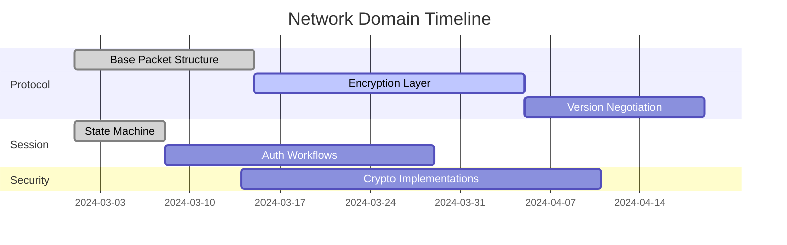

# Network Domain Implementation State
DO NOT REMOVE: This is file used to track the project status for a domain. Do not change the sections or headings. Leave all section instructions in place. Follow the instructions for each section and preserve the legend below. On first past, please update the name of this plan with the subdomain under work

Legend:
  - [ ] Incomplete task
  - [-] Partially complete task but not being worked on
  - [O] Task currently being worked on
  - [X] Complete task

### Implementation Tasks

1. [O] **Protocol Handling Foundation**
  - [O] Base packet structure definitions
  - [ ] Encryption/decryption workflows
  - [ ] Version negotiation system
  - [ ] Padded packet variants
  - [ ] FEAL-8 algorithm port

2. [ ] **Session Management**
  - [ ] Connection state machine
  - [ ] Authentication workflows
  - [ ] Server type detection
  - [ ] Session persistence

3. [ ] **Security Infrastructure**
  - [ ] Whirlpool hash integration
  - [ ] Snefru algorithm port
  - [ ] Packet validation framework
  - [ ] Anti-cheat detection

### Critical Open Questions

1. [ ] **Packet Version Handling**
  - How to handle server-specific packet variations?
  - Proposed Solution: Versioned parser architecture with fallback

2. [ ] **Session Persistence Strategy**
  - Should session data be stored in-memory or persisted to disk?
  - Options: Hybrid approach with memory cache + encrypted disk storage

### Open Issues
- [ ] Handle packet checksum validation for multiple RO versions
- [ ] Improve error recovery in connection state machine
- [ ] Standardize encryption interface across algorithms

