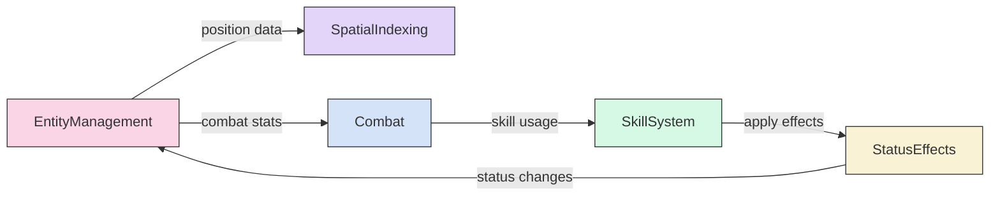
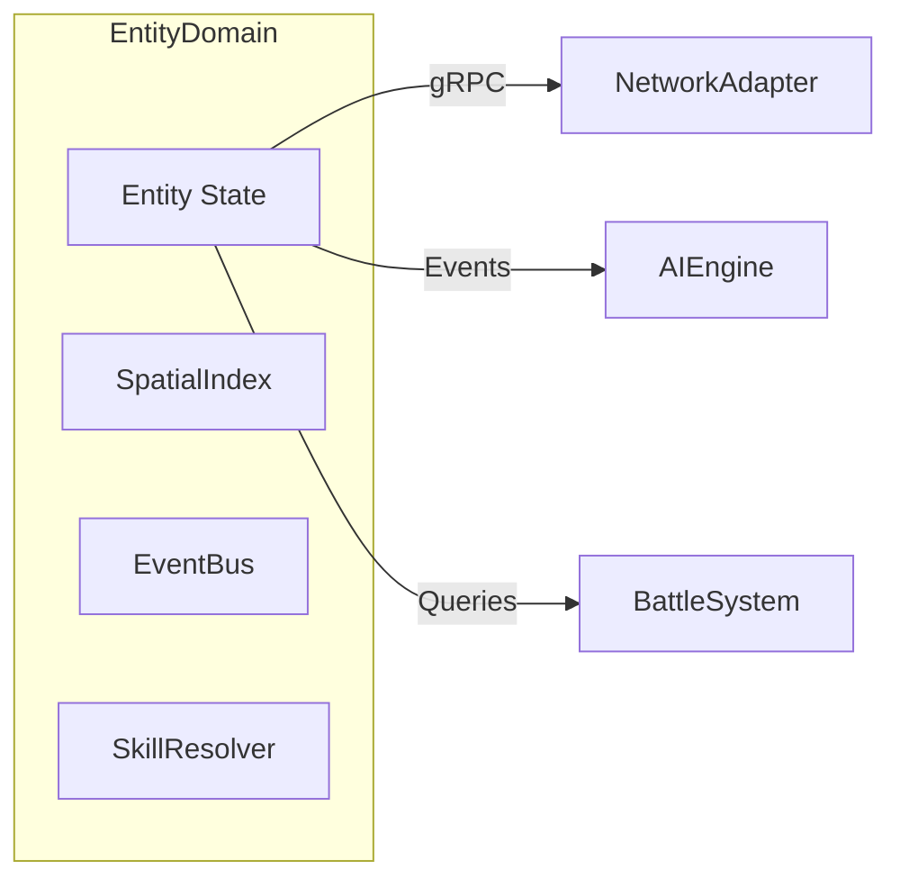
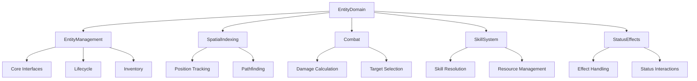
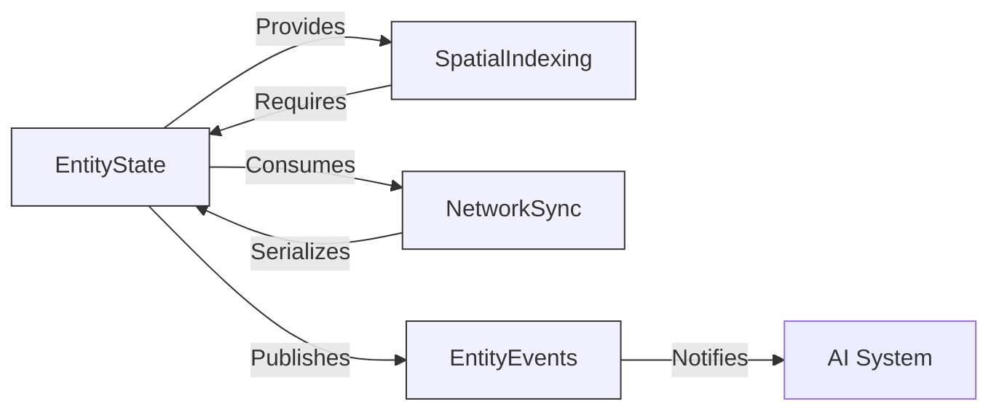
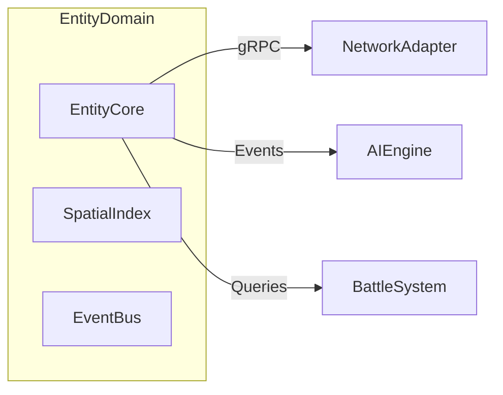
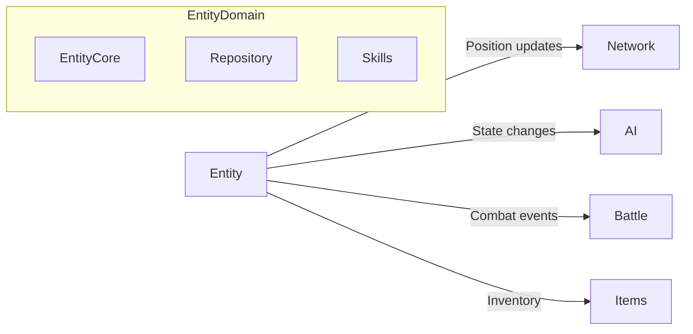

# Entity Domain Design

## Entity Domain Subdomains

### 01-EntityManagement
- Core entity lifecycle (create/update/destroy)
- Inventory and equipment systems
- Party relationships and sharing  
- Base attribute validation
- Perl compatibility layer

### 02-SpatialIndexing  
- Position tracking and validation
- Quadtree-based spatial indexing
- Movement pathfinding algorithms
- Collision detection
- Range query optimization

### 03-Combat
- Damage formula implementation  
- Attack sequencing and timing
- Target selection logic
- Combat stat management
- Aggro tracking

### 04-SkillSystem
- Skill definitions and databases
- Casting resource management
- Skill effect resolution  
- Interrupt handling
- Client skill packet emulation

### 05-StatusEffects
- Status effect lifecycle hooks
- Buff/debuff interactions
- Immunity and resistance tracking  
- Timed expiration system
- Status visualization

## Cross-Domain Integration


## Key Perl Implementation Files
- `src/Actor.pm`: Core entity logic (600+ lines)
- `src/Globals.pm`: Entity registries (400+ lines)
- `src/Misc.pm`: Combat formulas (150+ lines) 
- `src/Skill.pm`: Skill database (300+ lines)
- `src/Utils.pm`: Spatial calculations (200+ lines)

## Core Abstractions

### Entity Interface
- Identity management (ID, name, type)
- Position and spatial relationships
- Core attributes (HP/SP/Stats)
- Status effect tracking
- Inventory and equipment management

### Behavioral Contracts
- `InventoryHolder` - Item equip/unequip and weight management
- `PartyMember` - Party relationships and sharing rules
- `StatusBearer` - Status effect application/removal
- `SkillUser` - Skill availability and usage (delegates to SkillSystem)

### Domain Services
- `EntityRepository` - CRUD operations and queries
- `EntityValidator` - State integrity checks
- `EntityFactory` - Prototype-based instantiation
- `EntityEventBus` - Publish/subscribe for state changes


## Cross-Cutting Concerns

### Concurrency Model
- Entity-level operation serialization
- Lock ordering protocols (see SUPPLEMENT-concurrency.md)
- Context-based timeouts
- Channel-based event system
- Atomic state updates
- Worker pool pattern for batch operations

### State Validation
- Position sanity checking  
- Stat boundary enforcement
- Protocol compliance

### Observability
- Change auditing
- Metrics instrumentation
- Debug visualization

## Domain Services

1. **Entity Factory**  
   - Prototype-based instantiation
   - ID generation
   - Type validation

2. **World State**  
   - Global entity registry
   - Cross-entity queries
   - Transactional updates

3. **Skill Resolution**  
   - Effect application
   - Target validation
   - Resource costing (see SUPPLEMENT-skills.md)

## Integration Patterns



## Domain Model



## Subdomain Boundaries



## Supplemental Files
Please suggest adding or removing these files from the LLM context based on what the current working task is. 

### Core Systems
- **SUPPLEMENT-concurrency.md** - Concurrency patterns and synchronization
  - Per-entity goroutine design
  - Mutex/Channel/Atomic comparison
  - Deadlock prevention strategies

- **SUPPLEMENT-ecs.md** - Entity-Component-System implementation
  - Protocol buffer integrated components
  - Skill/Casting component definitions
  - ECS vs OOP performance comparison
  - Hybrid approach with adapters

- **SUPPLEMENT-skills.md** - Skill system implementation
  - DDD aggregates matching Skill.pm
  - Protocol buffer definitions
  - Target type constants (TARGET_*)
  - Validation rules from Perl logic

### Entity Behavior
- **SUPPLEMENT-spawning.md** - Entity creation/respawn
  - Spawn record structure
  - Timed/Conditional/Boss spawn types
  - Perl-to-Go migration notes

- **SUPPLEMENT-status.md** - Status effect system
  - Status effect lifecycle hooks
  - Stacking/refresh policies
  - Common status definitions

- **SUPPLEMENT-combat.md** - Combat calculations
  - Damage formulas from RO client
  - Critical hit/miss logic
  - Combat event types

### Infrastructure 
- **SUPPLEMENT-spatial.md** - Spatial indexing
  - Quadtree implementation
  - Range query algorithms
  - Collision detection

- **SUPPLEMENT-packets.md** - Network protocol
  - Entity update packet format
  - Movement delta structure
  - State flag bitmask

- **SUPPLEMENT-ids.md** - Entity identification
  - 4-byte binary format
  - Type ranges and validation
  - Perl compatibility layer

### Data Flow
- **SUPPLEMENT-events.md** - Event system
  - Core event types (Spawn/Move/Attack)
  - Channel sizing guidelines
  - Payload structures

- **SUPPLEMENT-serialization.md** - Data formats
  - Binary marshal/unmarshal
  - Delta compression
  - Version migration

### Specialized Systems
- **SUPPLEMENT-inventory.md** - Inventory mgmt
  - Slot allocation constants
  - Stacking rules
  - Weight calculations

- **SUPPLEMENT-party.md** - Party system
  - EXP distribution algorithms
  - Loot distribution policies
  - Role-based sharing

- **SUPPLEMENT-effects.md** - Skill effects
  - Effect composition
  - Damage/Heal/Status effect types
  - Resistance checking

## Implementation Roadmap
1. **Core Interfaces** (`Entity`, `Repository`)
2. **Memory Repository** with spatial indexing
3. **Protocol Adapters** for network sync
4. **Event System** integration
5. **Benchmarking** against Perl implementation

## Cross-Domain Integration


### 2. Skill System
```go
type SkillSystem struct {
    repo EntityRepository
}

func (ss *SkillSystem) Cast(caster Entity, skill SkillID, target Entity) error {
    // Validate range
    if !ss.InRange(caster, skill, target) {
        return ErrTargetOutOfRange
    }

    // Apply effects
    // ...
}

func (ss *SkillSystem) InRange(caster Entity, skill SkillID, target Entity) bool {
    baseRange := skillDB[skill].Range
    return caster.Position().DistanceTo(target) <= baseRange
}
```

### 3. Status Effect System
```go
type StatusEffect struct {
    ID          StatusEffectID
    StartedAt   time.Time
    Duration    time.Duration
    Stacks      int
}

type StatusSystem struct {
    effects map[EntityID]map[StatusEffectID]*StatusEffect
}

func (ss *StatusSystem) Apply(e Entity, effect StatusEffectID, duration time.Duration) {
    // Handle stacking rules
    // Dispatch effect hooks
}
```

## Domain Services

### Entity Repository
```go
// Combines ActorList.pm and Globals.pm registry functionality
type EntityService interface {
    Get(EntityID) (Entity, error)          // ActorList::getByID
    FindNearest(EntityFilter) (Entity, error) // Actor::getByName
    Add(Entity) error                      // ActorList::add with ID check
    Remove(EntityID) error                 // ActorList::removeByID
    
    // Query patterns
    ByType(EntityType) []Entity            // $monstersList/$playersList
    InRadius(Position, float64) []Entity   // Field::calculateRectArea
    
    // Concurrency control
    Snapshot() []EntityState               // Atomic read copy
    Version() uint64                       // Change detection
}
```

### State Validation
```go
// Enforces Perl validation rules from Actor.pm and ActorList.pm
type Validator interface {
    ValidatePosition(Position) error     // Field boundaries check
    ValidateInventory(Inventory) error   // Weight/slot rules
    CheckCollisions(Entity) []Entity     // Spatial conflicts
}
```

## Anti-Corruption Layer

```go
// LegacyAdapter converts Perl data structures
type LegacyAdapter struct {
    factory EntityFactory
}

func (la *LegacyAdapter) ConvertMonster(perlData map[string]interface{}) (Entity, error) {
    return la.factory.Create(TypeMonster,
        parseID(perlData["ID"]),
        Position{
            X: perlData["pos"]["x"],
            Y: perlData["pos"]["y"],
        })
}
```

## Domain Events

```go
type EventBus interface {
    Publish(event Event)
    Subscribe(topic string, handler EventHandler)
}

type Event struct {
    Type    string
    Source  EntityID
    Target  EntityID
    Payload interface{}
}

// Example events:
const (
    EventEntitySpawned = "entity.spawned"
    EventEntityMoved   = "entity.moved"
    EventSkillUsed     = "skill.used"
)
```

## Implementation Roadmap

1. **Core Interfaces** (`Entity`, `EntityRepository`)
2. **Memory Repository** (in-memory implementation)
3. **Spatial Indexing** (quadtree/grid for fast queries)
4. **Skill System** (basic casting mechanics)
5. **Status Effects** (timed buffs/debuffs)
6. **Movement System** (pathfinding integration)

## Cross-Domain Integration



This design maintains clean separation while allowing integration points with other domains through:
- Domain events
- Shared value objects (Position, EntityID)
- Narrow interfaces

Key decisions made:

1. **Interface-based design** - Allows multiple implementations and easy testing
2. **Spatial separation** - Entities don't know about positioning systems
3. **Event-driven** - Decouples entity behaviors
4. **Perl compatibility** - Anti-corruption layer for migration
5. **Deferred complexity** - Skills/statuses have simple initial implementations

The design:
- Matches OpenKore's core entity model
- Adapts Perl strengths to Go's type system
- Prepares for containerized deployment
- Allows incremental implementation
