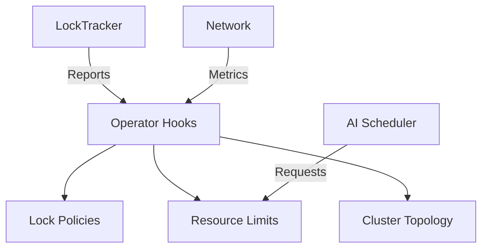

# Orchestration Subdomain

## 1. Purpose
Manage Kubernetes integration and container orchestration coordination across domains

## 2. Core Components


## 3. Contracts
```go
type ClusterOperator interface {
    RegisterLockPolicy(policy LockPolicy)
    ReportDeadlock(d Deadlock) 
    GetNodeAffinity() NUMAAffinity
    AdjustResources(adjustment ResourceAdjustment)
    GetLockHierarchy() map[uintptr]int
    GetQOSClass() QOSLevel
}

type ResourceAdjustment struct {
    CPUShares     int
    MemoryMB      int 
    GPUSlots      int
    LockLimit     int
    Priority      string
    MinQOS        QOSLevel // Minimum required QoS class (see INTERFACES.md)
}

type NUMAAffinity struct {
    Node         int
    AllowedNodes []int
    DistanceMap  map[int]int
    QOSPriority  map[QOSLevel]int // Priority weights per QoS class
}

// QoSPolicy defines resource guarantees per class
type QoSPolicy struct {
    Guaranteed Resources
    Burstable  Resources
    BestEffort Resources
}

type Resources struct {
    CPUMillicores int
    MemoryMB      int
    MaxLocks      int
    MaxGoroutines int
}
```

## 4. Migration Notes
1. **Kubernetes CRD Integration**:
   - Custom Resource Definitions for lock policies
   - Admission controllers for resource validation
   - Operator pattern for deadlock resolution
   - NUMA-aware concurrency policies (see [SUPPLEMENT-numa.md](../../01-Concurrency/01-ConcurrencyCore/SUPPLEMENT-numa.md))
   - Example CRD:
     ```yaml
     apiVersion: orchestration.gokore.io/v1beta1
     kind: ConcurrencyPolicy
     spec:
       numa:
         allowedCrossAccess: 15%
         stealThreshold: 5
       qosClassMapping:
         - priority: 0
           name: critical
           numaExclusive: true
     ```

   Example Concurrency Integration:
   ```go
   // Systems domain implementation
   func handleDeadlock(d Deadlock) {
       if d.Duration > ContainerConfig.DeadlockThreshold {
           evictPod(d.Pod)
       }
       updateConcurrencyMetrics(d)
   }
   ```

2. **Cross-Domain Coordination**:
   - Concurrency: Lock hierarchy visualization
   - Network: Bandwidth allocation
   - AI: Compute resource negotiation
   - Container: Resource quota enforcement
   ```mermaid
   graph TD
       A[Concurrency] -->|Metrics| B(Systems)
       C[Network] -->|Bandwidth| B
       D[AI] -->|Compute| B
       B -->|Enforcement| E[K8s]
   ```

3. **Security**:
   - Pod security policies for lock access
   - RBAC for cluster operations
   - Network policies for cross-pod communication
   - Namespace isolation for concurrency primitives
