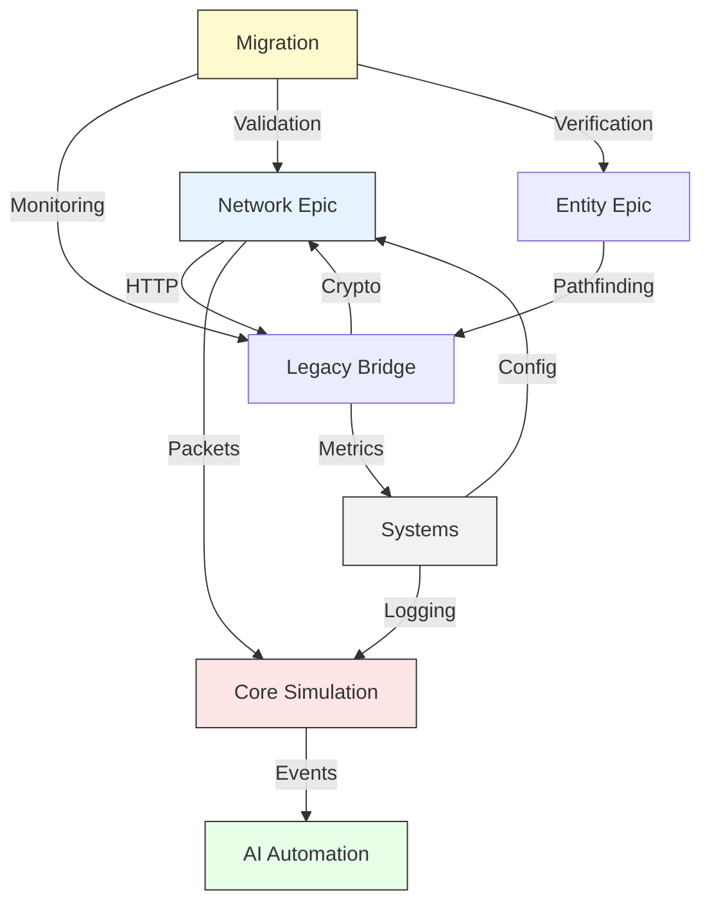
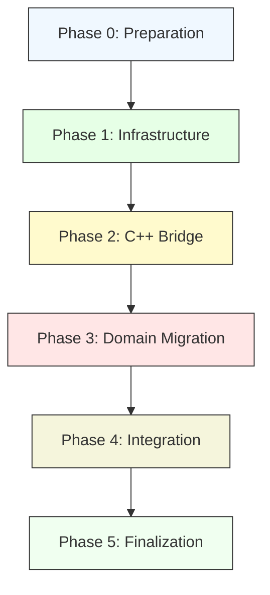
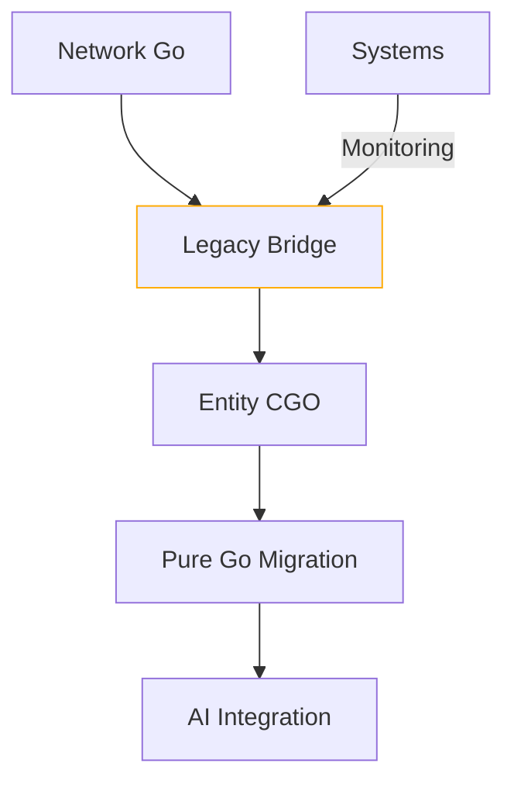

# OpenKore Domain Architecture

This document organizes OpenKore's functionality into a hierarchical domain structure with Epics (high-level capabilities) and Subdomains (bounded contexts).

## 2. Concurrency Epic

### 01-ConcurrencyCore Subdomain
- **Responsibilities**:
  - Central lock hierarchy definition
  - Atomic primitive implementations
  - Deadlock detection system
  - Channel patterns and topologies
- **Key Files**:
  - `src/concurrency/lock_hierarchy.go`
  - `src/concurrency/atomic_primitives.go`

### 02-Performance Subdomain
- **Responsibilities**:
  - Worker pool management
  - Lock contention metrics
  - Channel buffer sizing
  - Goroutine profiling
- **Key Files**:
  - `src/concurrency/worker_pools.go`
  - `src/concurrency/profiling.go`

## 1. Network Epic

### Protocol Subdomain
- **Responsibilities**:
  - Packet serialization/deserialization
  - Message routing protocols  
  - Connection state management
  - Entity state synchronization
  - Network event handling
  - Version detection
  - Cipher negotiation
- **Key Files**:
  - `src/Network.pm` (connection states)
  - `src/Network/Receive.pm` (packet parsing)
  - `src/Network/Send.pm` (command serialization)
  - `03-Networking/01-Protocol/SUPPLEMENT-packets.md` (packet formats)
  - `03-Networking/01-Protocol/SUPPLEMENT-events.md` (network events)

### Session Subdomain
- **Responsibilities**:
  - Authentication flow
  - Character selection
  - Map server handoff  
  - Session key management
  - Reconnection logic
  - Multi-client coordination
- **Key Files**:
  - Login sequence handlers in Network files

## 3. Entity Domain Epic

### 01-EntityManagement Subdomain
- **Responsibilities**:
  - Core entity lifecycle (create/update/destroy)
  - Inventory and equipment management  
  - Party relationships
  - Base attributes and state validation
- **Key Files**:
  - `src/Actor.pm` (core entity model)
  - `src/Globals.pm` (entity registries)

### 02-SpatialIndexing Subdomain
- **Responsibilities**:
  - Position tracking and validation
  - Movement pathing algorithms
  - Collision detection
  - Range-based queries
- **Key Files**:
  - `src/Utils.pm` (distance calculations)  
  - `src/Field.pm` (map coordinates)

### 03-Combat Subdomain
- **Responsibilities**:
  - Damage calculations
  - Attack sequencing  
  - Target selection
  - Combat stat management
- **Key Files**:
  - `src/Misc.pm` (combat formulas)
  - `src/auto/XSTools/OSL/Exception.*` (combat errors)

### 04-SkillSystem Subdomain  
- **Responsibilities**:
  - Skill definitions and resolution
  - Resource costing (SP/items)
  - Casting interrupts
  - Effect chaining
- **Key Files**:
  - `src/Skill.pm` (skill database)
  - `src/Network/Send.pm` (skill packets)

### 05-StatusEffects Subdomain
- **Responsibilities**:
  - Status effect lifecycle
  - Buff/debuff interactions  
  - Immunity tracking
  - Timed effect expiration
- **Key Files**:
  - `src/Actor.pm` (status methods)
  - `src/Globals.pm` (status tables)

## 4. AI Automation Epic

### Task System Subdomain
- **Responsibilities**:
  - Task scheduling
  - Priority management
  - Mutex handling
- **Key Files**:
  - `src/AI.pm` (core sequencing)
  - `src/TaskManager.pm` (scheduling)

### Behavior Subdomain
- **Responsibilities**:
  - Decision making
  - Goal management
  - Action planning
- **Key Files**:
  - AI behavior logic in `src/AI.pm`

## 5. Systems Epic

### 01-Legacy Bridge Subdomain
- **Responsibilities**:
  - Manage CGO-wrapped C++ components during migration
  - Validate memory safety across language boundaries
  - Track technical debt for gradual replacement
- **Key Components**:
  - `legacy/crypto` (Go-wrapped FEAL/Rijndael)
  - `migration/spatial` (Go pathfinding impl)
  - `net/socket` (Go-native sockets)
  - `concurrency/atomic` (sync/atomic wrappers)
  - `tools/stubgen` (CGO bridge generator)
- **Phase**: Temporary (mark for removal post-migration)

### 02-Configuration Subdomain
- **Responsibilities**:
  - Settings management
  - Profile handling
  - System defaults
- **Key Files**:
  - `src/Settings.pm`
  - `src/Globals.pm` (configuration vars)

### 03-Extension Subdomain
- **Responsibilities**:
  - Plugin lifecycle
  - Hook management
  - Module loading
- **Key Files**:
  - `src/Plugins.pm`
  - `src/Modules.pm`

### 04-Diagnostics Subdomain
- **Responsibilities**:
  - Logging
  - Error handling
  - Debug output
- **Key Files**:
  - `src/Log.pm`
  - `src/Interface.pm` (output handling)

### 05-Migration Subdomain (NEW)
- **Responsibilities**:
  - Coordinate phased migration of C++ components
  - Verify compatibility between old/new implementations
  - Monitor performance during transition
- **Key Components**:
  - `migration/concurrency` (Thread/Mutex replacements)
  - `migration/network` (Socket abstractions)
  - `migration/crypto` (Encryption bridges)
  - `migration/metrics` (Transition monitoring)
- **Migration Priority**:
  | Subdomain          | Difficulty | Approach     | Time Estimate |
  |--------------------|------------|--------------|---------------|
  | Concurrency        | Easy       | Rewrite      | 1-2 weeks     |
  | HTTP Client        | Easy       | Rewrite      | 1 week        |
  | Memory Management  | Easy       | Delete       | 3 days        |
  | I/O System         | Medium     | Hybrid       | 2-3 weeks     |
  | Network Stack      | Medium-Hard| Wrapper      | 3-4 weeks     |
  | Cryptography       | Hard       | Full Wrapper | 4+ weeks      |

## Cross-Domain Integration



## Recommended Additional Files

We should also add these files to complete the domain mapping:
- `src/TaskManager.pm` (for AI task system)
- `src/Field.pm` (for spatial calculations)
- `src/Utils.pm` (shared utilities)

## Migration Roadmap

### Phase 0: Preparation (1 week)
1. **Tooling Setup**
   - Establish Go build system with CGO support
   - Create LLM prompt templates for code generation
   - Set up cross-compilation for container targets

2. **Interface Contracts**
   - Document all C++/Perl interfaces needing preservation
   - Create compatibility test suite

### Phase 1: Infrastructure (2 weeks)
1. **Core Systems**
   - Implement Go-native replacement for `Mutex.cpp` using `sync` package
   - Replace `Thread.cpp` with goroutine-based task system
   - LLM Task: "Generate worker pool implementation matching OpenKore's threading model"

2. **Network Foundation**
   - Replace `http-reader.cpp` with Go `net/http`
   - Implement mirroring with circuit breakers
   - LLM Task: "Create HTTP client with timeout fallback and metrics"

### Phase 2: C++ Bridge (3 weeks)
1. **Legacy Bridge Implementation**
   - Pathfinding (`algorithm.cpp`):
     ```go
     /*
     #cgo LDFLAGS: -lpathfinding
     #include "pathfinding_wrapper.h"
     */
     type Pathfinder struct { ptr unsafe.Pointer }
     ```
   - Encryption (`feal8.cpp`, `Rijndael.cpp`):
     ```go
     //go:generate llmgen --input=feal8.h --output=legacy/crypto/feal8
     ```

2. **Adapter Layers**
   - Create Go interfaces matching C++ class APIs
   - Implement metrics for bridge performance monitoring

### Phase 3: Domain Migration (4 weeks)
1. **Network Domain**
   - Replace packet serialization with Protocol Buffers
   - Implement connection state machine in Go

2. **Entity Domain**
   - Migrate core entity lifecycle
   - Port spatial indexing algorithms

3. **AI Domain**
   - Rewrite task scheduler using Go channels
   - Implement behavior tree system

### Phase 4: Integration (2 weeks)
1. **Cross-Domain Testing**
   - Validate interface contracts
   - Performance benchmark against original
   - Stress test containerized deployment

2. **Optimization**
   - Profile and tune hot paths
   - Implement lock-free structures where applicable
   - Fine-tune GC parameters

### Phase 5: Finalization (1 week)
1. **Perl Compatibility**
   - Verify plugin API backwards compatibility (openkore.pl)
   - Document behavior differences
   - Create migration guide for script authors
   - Maintain $interface error handling parity

2. **Containerization**
   - Multi-stage Docker builds
   - Helm charts for Kubernetes
   - Observability stack (Prometheus/Grafana)

### Phase 6: Post-MVP Cleanup
1. **Legacy Removal**
   - Sunset CGO components
   - Remove Perl dependencies
   - Archive original C++ code

## Dependency Graph


## Key Metrics
| Phase | Success Criteria |
|-------|------------------|
| 0 | 100% of interface contracts documented |
| 1 | 90% reduction in threading-related bugs |
| 2 | <5% performance delta in bridged components |
| 3 | 100% domain test coverage |
| 4 | 99.9% uptime in stress tests |
| 5 | 100% plugin compatibility verification |

## Migration Dependency Graph


## Core Contracts and Interfaces

### Versioning Policy
| Interface               | Phase | Stability  | Source Files                     | Description |
|-------------------------|-------|------------|----------------------------------|-------------|
| **EntityRepository**    | 1     | Frozen     | ActorList.pm, Actor.pm           | Manages entity lifecycle and queries |
| **LegacySocket**        | 1     | Migrated   | net/socket.go                    | Go-native socket implementation |
| **CryptoBridge**        | 1     | Frozen     | PaddedPackets/Algorithms/*       | Encryption compatibility |
| **MigrationMonitor**    | 1     | Stable     | migration/metrics/*              | Transition verification |
| **SkillResolver**       | 2     | Provisional| Skill.pm                         | Handles validation, costs and effects |
| **SkillService**        | 2     | Stable     | Skills.pm                        | Coordinates skill execution flow |
| **NetworkSerializer**   | 1     | Stable     | Network/Receive.pm, Network/Send.pm | Packet serialization/deserialization |
| **SpatialProvider**     | 2     | Draft      | Field.pm, Utils.pm               | Provides spatial queries and pathfinding |
| **ThreadPool**          | 1     | Provisional| concurrency/worker_pools.go      | Goroutine-based task execution (Go migration) |
| **CryptoProvider**      | 1     | Frozen     | Rijndael.cpp, feal8.cpp          | Encryption/decryption services |
| **HTTPClient**          | 1     | Provisional| http-reader.cpp                  | Asynchronous HTTP requests |
| **TaskScheduler**       | 2     | Draft      | TaskManager.pm, AI.pm            | AI behavior task management |
| **PluginSystem**        | 1     | Stable     | Plugins.pm, Modules.pm           | Extension point management |


### New Migration Contracts
```go
// contracts/migration.go
type WrappedComponent interface {
    CGoHandle() unsafe.Pointer
    Version() LegacyVersion
    Metrics() WrapperMetrics
}

type MigrationVerifier interface {
    CompareOutputs(goImpl, cppImpl interface{}) ([]Discrepancy, error)
    Benchmark(bothImpl interface{}) PerformanceDelta
}
```

### New Interface Contracts Needed

#### 1. **Concurrency Contracts**
```go
// concurrency/interfaces.go
type LockManager interface {
    NewMutex() SyncMutex
    NewRWMutex() SyncRWMutex
    DeadlockDetect() <-chan DeadlockReport
}

type TaskPool interface {
    Submit(task Runnable) error
    Scale(workers int) error
    Metrics() PoolMetrics
}
```

#### 2. **Skill System Contracts**
```go
// skills/interfaces.go
type SkillResolver interface {
    Validate(skill Skill, target Entity) error
    CalculateCost(skill Skill, caster Entity) Resources
    ApplyEffects(skill Skill, targets []Entity) []EffectResult
}

type SkillService interface {
    Execute(skill Skill, target Entity) error
    Cancel(skill Skill) error
    GetCooldown(skill Skill) time.Duration
}

// network/interfaces.go
type SkillSerializer interface {
    SerializeSkill(skill Skill, target Entity) ([]byte, error)
    SerializeInterrupt() ([]byte, error)
}
```
```go
// network/interfaces.go
type PacketHandler interface {
    Handle(packet []byte) ([]Event, error)
    Serialize(events []Event) ([][]byte, error)
}

type ConnectionState interface {
    Transition(event Event) error
    Current() State
}
```

#### 3. **Entity Contracts**
```go
// entity/interfaces.go
type SpatialIndex interface {
    Insert(e Entity) error
    QueryRange(rect Rectangle) []Entity
    Move(e Entity, from, to Position) error
}

type StatusSystem interface {
    Apply(target Entity, effect Effect) error
    Expire(target Entity, effectID string) error
}
```

#### 4. **Legacy Bridge Contracts**
```go
// legacy/interfaces.go
type CGOBridge interface {
    Call(method string, args []byte) ([]byte, error)
    Free(resourceID string) error
    Metrics() BridgeMetrics
}
```

### Validation Requirements
1. **Thread Safety Verification**:
   - All interfaces must document their thread-safety guarantees
   - Generate concurrency tests using `go test -race`

2. **Perl Compatibility Layer**:
```go
// perl/compat.go
type PerlCompat interface {
    CallMethod(obj interface{}, method string, args ...interface{}) ([]interface{}, error)
    ExportConstants(pkg string) error
}
```

3. **Performance Contracts**:
   - Network: <2ms 99th percentile serialization
   - Pathfinding: <5ms for 100-node paths
   - Entity updates: <1μs per entity

## Cross-Domain Contracts
1. **Entity <> Network**
   - Serialization format
   - Delta update protocol
   - Compression requirements

2. **Entity <> Spatial**
   - Position validation API
   - Movement event schema
   - Collision detection

3. **Entity <> Skills**
   - Target validation
   - Effect application
   - Resource consumption
